# Primera instalació del firmware a una NanoStation M5

Aquest pas-a-pas explica com instal·lar el firmware a les NanoStation quan venen de fàbrica.
Per defecte venen amb AirOS pensada per enllaços punt a punt,
i l'hem de substiuir per un qMp pensada per funcionar en maia.

Primer, cal baixar el darrer firmware qMp disponible per la nostra antena.

El trobareu al link 'Binary files' de la [pàgina oficial de qmp.cat](http://qmp.cat).

Busqueu i descarregueu el NanoStation-M5-qMp-testing-factory amb la data més recent.
Per si de cas, pregunteu als altres guifibaixeros, no fós que la darrera versió no estigués funcionant.

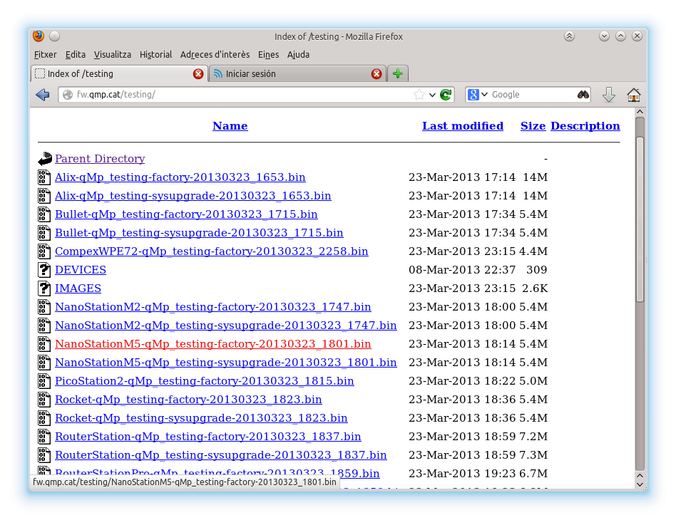

Connecteu l'antena al POE i per Ethernet a l'ordinador que esteu fent servir.
Si feu servir un router entre mig, es posible que no veieu l'antena
perque el router fica l'ordinador a una xarxa diferent.

Un cop connectats accediu a l'adreça que diu a la caixa de l'antena.
Valideu amb l'usuari i la password que tambe posen a la caixa.
Normalment, son les que surten a la pantallada (la password és igual que l'usuari).

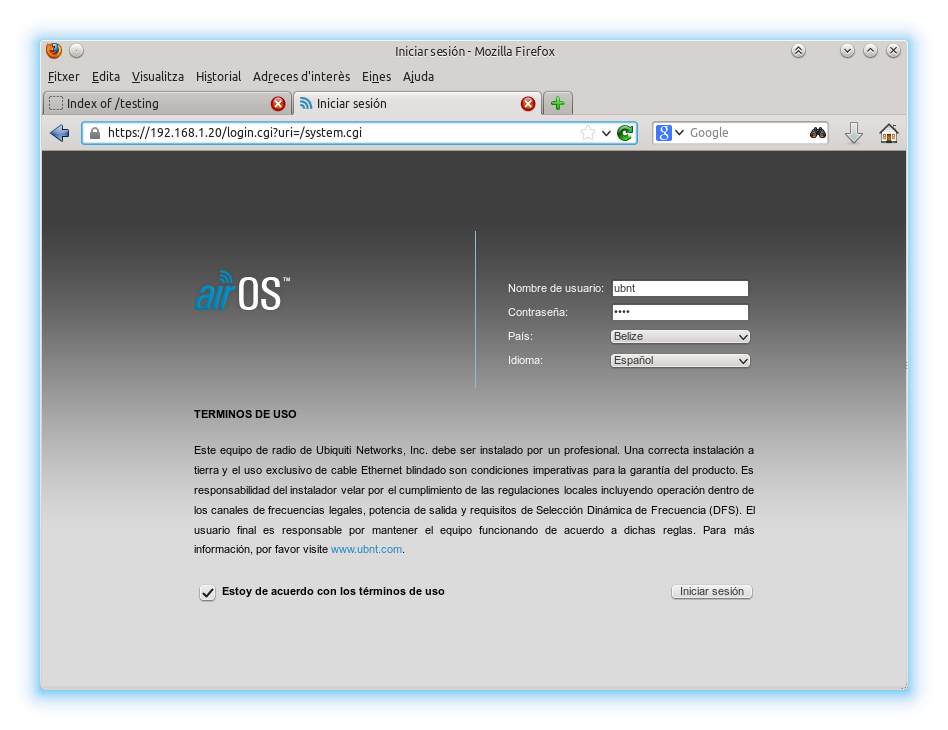

Un cop a dins, anem a la pestanya "System" i clickeu al boto "Navega" al lado de "Subir Firware".
Escull el fitxer que has baixat.

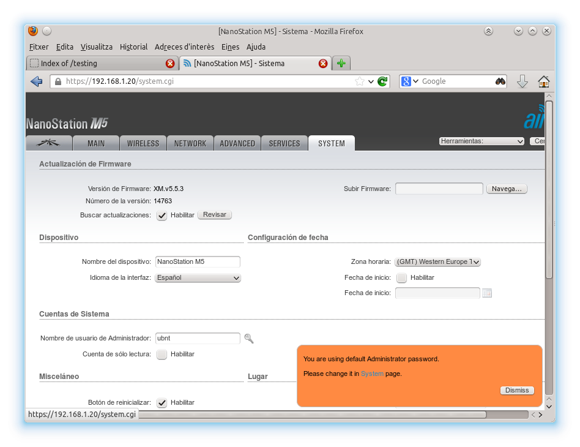

Després de pujar la imatge, et surtirà aquest advertiment culpidor.
Com no podem saber si funcionarà fins que ho provem, clicka a "Actualizar".

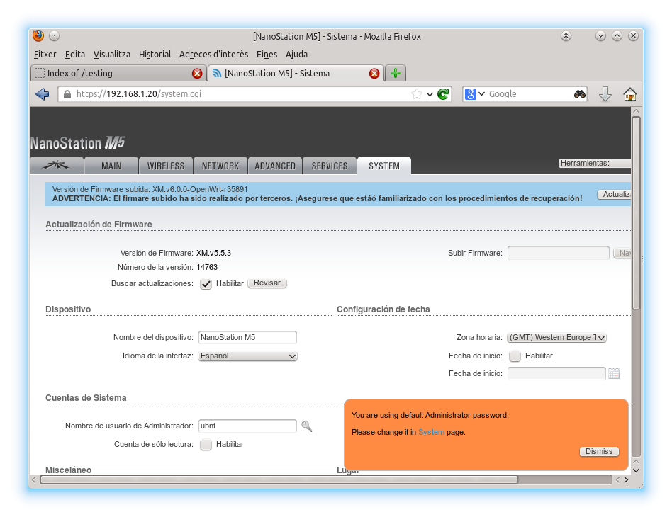

Ens surt aquesta barra de progrés, perque preguis a santa Endesa del Monopolio perqué no s'ens vagi la llum a mitges.

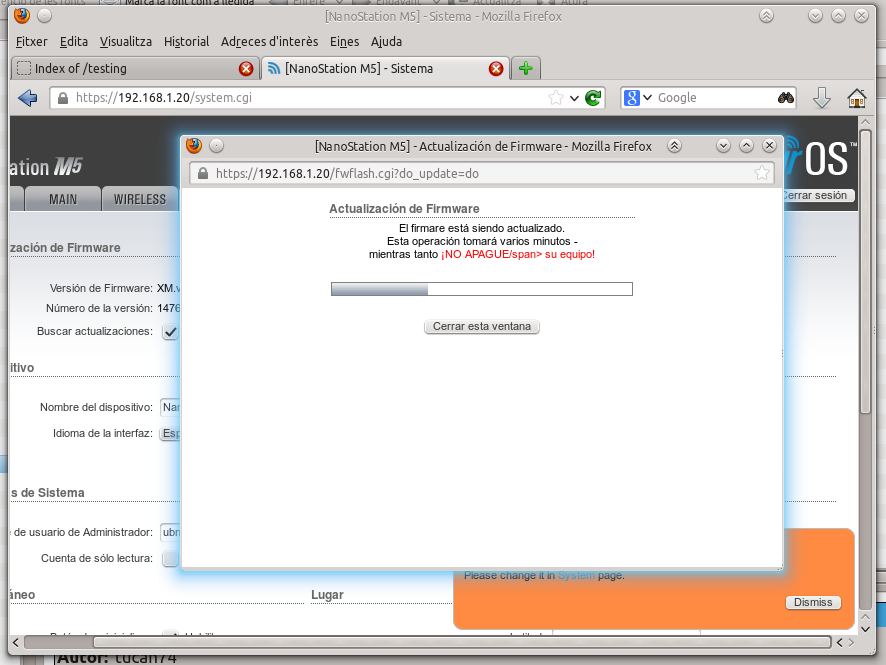

La càrrega triga poquet i, quan l'antena es reinicia, el navegador donara un error de que no hi ha xarxa.
Es normal.

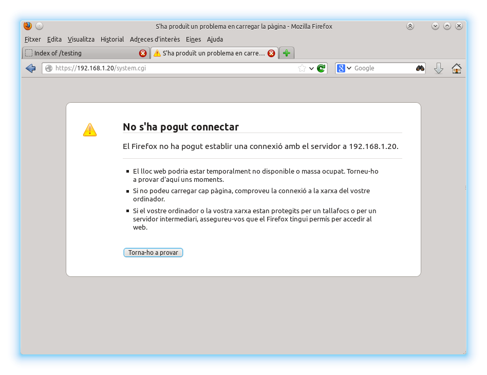

qMp canvia l'adreça de l'antena.
Ens hem de connectar a http://172.30.22.1 .

TOCHECK: Aquesta és l'adreça que sempre està disponible encara que canviis la IP cap en fora?

Usuari 'root', contrasenya, pregunta als altres guifibaixeros.

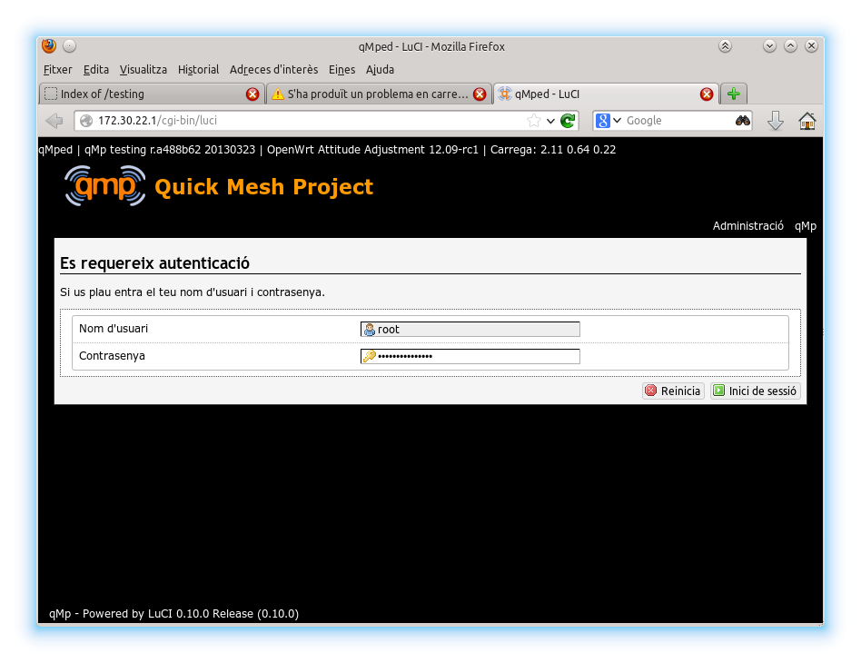

Un cop a dintre sortira la pantalla principal de qMp:

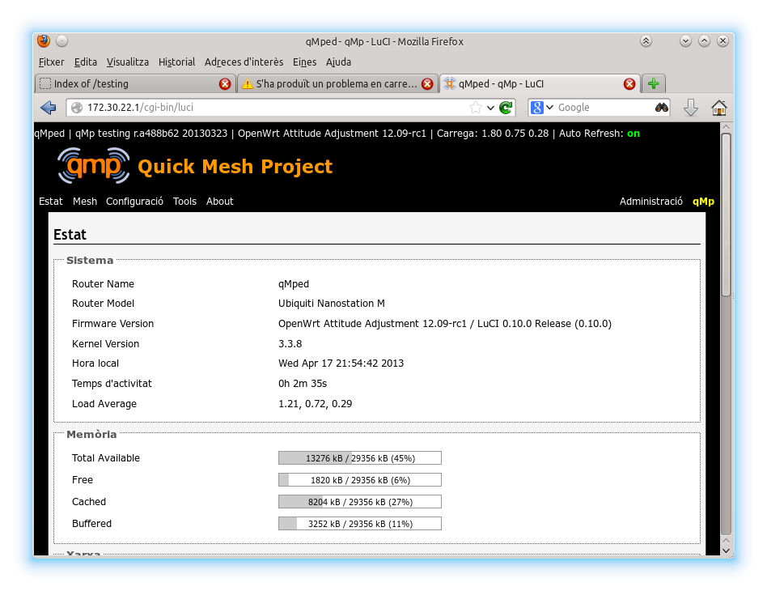

TODO: Cal explicar com canviar la password com la primera cosa a fer.

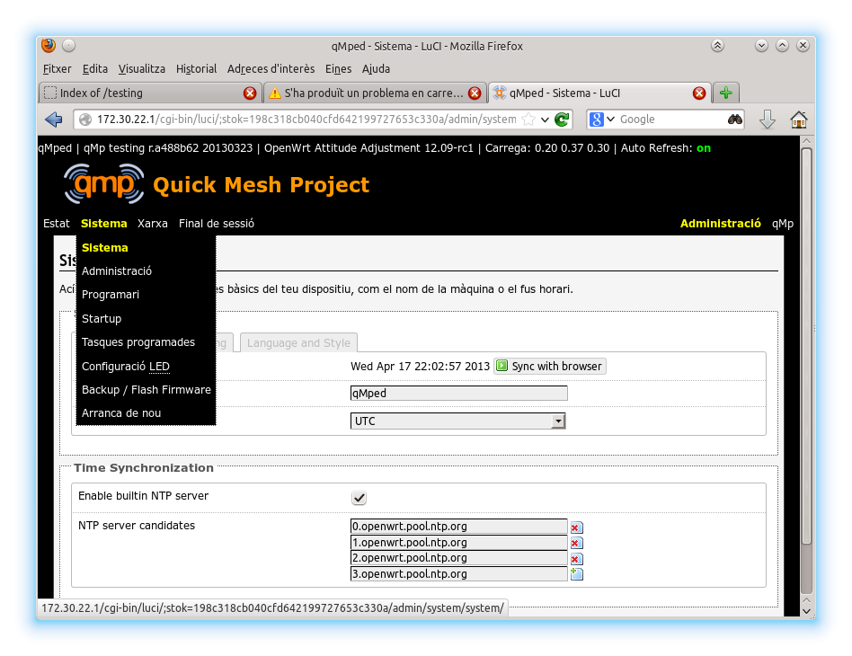
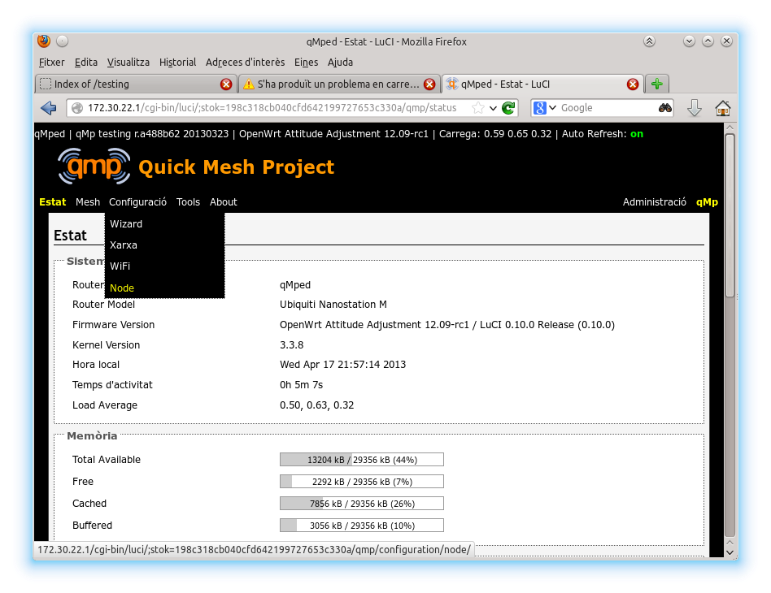
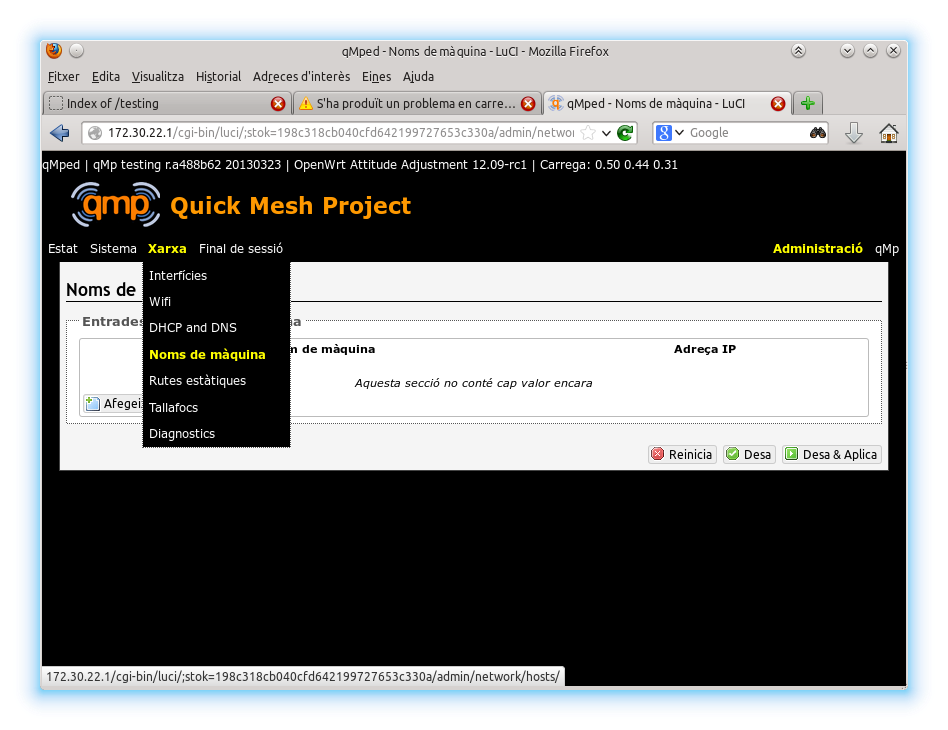
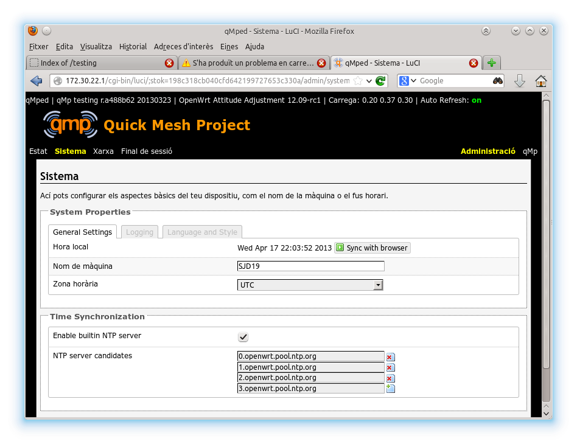
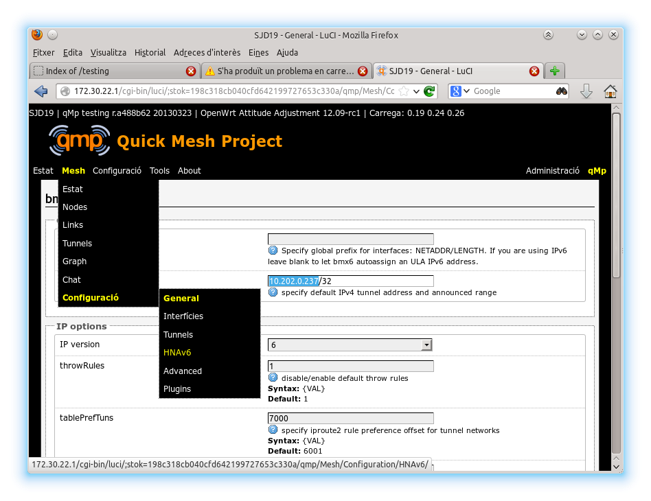
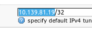
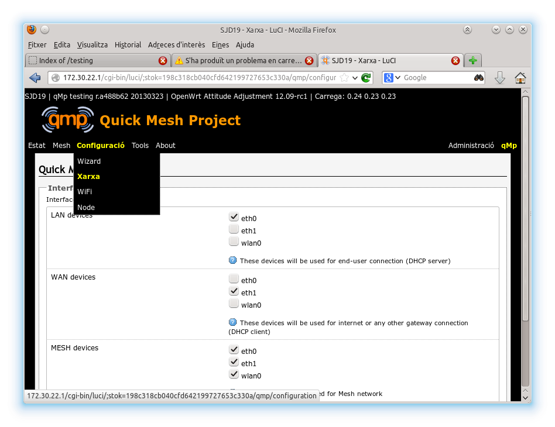
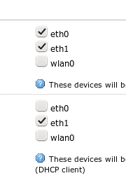

TODO: Si tot va malament com resetejar a l'estat de fàbrica.

