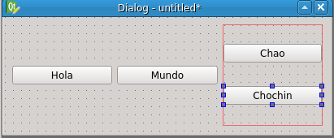
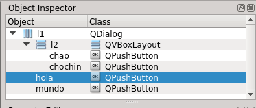

# Programación: Interfícies gràficas de escritorio

## La libreria Qt

Qt es una [librería] de programación para hacer interficies gráficas.

- Programada en C++ pero existen adaptadores para usarla desde otros lenguajes
- Para Python hay dos adaptadores: PySide y PyQt
- Nosotros usamos PySide para el `suro` así que la formación la haremos con PySide
	- `sudo apt-get install python3-pyside`
- La ultima version de Qt es 5.x, pero usamos la 4.x porque no hay PySide para Qt5
- El codigo con PyQt es muy parecido al codigo con PySide, cambian los imports y poca cosa más
- Documentacion
	- Qt: http://docs.qt.io/
	- PySide: TODO
	- La documentacion de Qt explica mejor las clases, pero el codigo de ejemplo esta en C++

[librería]: código ya hecho, listo para usar y reusar en diversos programas

## Programa Python mínimo en Qt

Ejercicio: Crea este script y ejecutalo

	#!/usr/bin/env python3
	from PySide import QtGui
	
	app = QtGui.QApplication([])
	w = QtGui.QDialog()
	w.show()
	app.exec_()

En este programilla ya hay bastante teca que explicar:

### Módulos y clases

- Repasamos conceptos que ya conocemos: clases y modulos/paquetes
- Se importa el módulo `QtGui` de dentro de la libreria `PySide`
	- Culturilla: Las Qt son extensas y los modulos sirven para que
	una applicación no tenga que arrastrarlas enteras,
	solo las pijadas que necesite:
		- Interficie gráfica
		- Multimedia
		- Animaciones
		- Graficos 3D
		- Redes
		- Sensores (GPS, acelerómetro...)
		- Navegacion web
		- ...
	- Culturilla2: QtGui viene de GUI que quiere decir ''Graphical User Interface''.
	- Culturilla3: En contraste a los GUI estan los CLI, los TUI y los WUI.
    	- Los CLI (Command line interface), pe. `git`, `grep`, estan pensado para su uso con tuberias y scripts,
	 	- Los TUI (Text User Interfaces), pe. `htop`, `tig`, `aptitude`, tambien son de consola de texto pero estan pensados para su uso interactivo.
		- Los WUI (Web-based User Interface) pe. `github`, `bitbucket`, `gitlab`, `mediateca`, `facebook`...
		- Seguimos...
- `QApplication` y `QDialog` son [clases] definidas dentro del modulo `QtGui`
- Creamos instancias de esas clases llamándolas con los paréntesis como si fueran una función.
- Al `QApplication` se le pasa una lista vacía `[]` o `sys.argv`

### Orientacion a eventos

- Una vez creados los objetos llamamos:
	- Al metodo `show()` del dialogo, para que muestre el dialogo que hemos construido
	- Al metodo `exec_()` de la aplicacion, para que empiece el bucle de eventos
- Casi todo el tiempo la aplicacion lo pasa dentro del `exec_`
- El `exec_` es un bucle que espera eventos y, según el evento que suceda, llama a unas partes o otras de nuestro programa
- Tenemos que definir la interficie y como reaccionara a esos eventos antes de entrar en el `exec_`
- Antes de entrar en el `exec_` tenemos que haber definido como es nuestra interficie y como responder a esos eventos
	- Culturilla: Esto se llama 'Orientacion a eventos'
- La libreria Qt proporciona ese bucle de eventos y las respuestas mas comunes
	- Nosotros solo tenemos que programar las respuestas específicas de nuestra aplicación
- En este caso hemos creado un dialogo vacio `QDialog`
	- El dialogo ya sabe como responder a algunos eventos.
	- Por ejemplo si pulsamos a la tecla ESC, el dialogo se cierra.
	- Como es nuestra unica ventana, al cerrarse, se acaba la aplicacion.

## El Qt Designer

Designer: Herramienta gráfica para editar interfícies

- Instalacion: `sudo apt-get install qt4-designer`
- Construyes una interfície arrastrando elementos gráficos
- Graba un XML que describe la interficie
- Despues, hay utilidades que, a partir de ese XML, generan código C++, Python...
- pyside-uic: El generador de codigo python para PySide
	- `sudo apt-get install pyside-tools`
- Veremos como usar ese código más adelante

- En el centro tenemos la interficie que editamos
	- Puede ser tipo:
		- Dialogo: ventana que pregunta datos y que podemos aceptar o cancelar
		- MainWindow: ventana con menus, barra de herramientas...
		- Widget: composicion de widgets basicos que podemos insertar en bloque en otra interfície
- La editamos via los diferentes paneles laterales:
	- Widget box: Los tipos de elementos, podemos arrastrarlos a la interficie
	- Object inspector: el arbol de composicion (estructura) de la interficie
	- Property editor: permite cambiar propiedades de los elementos
	- Resource Browser: Sirve para incrustar iconos e imagenes en el programa

Ejercicio:

- Crea un dialogo en designer y arrastrale elementos gráficos desde el 'widget box'
- Puedes probar el dialogo con `Control+R`

## Widgets y propiedades

- **Widget:** Elemento gràfico: boton, checkbox. radiobutton, campo de edicion, dialogo, listas...
	- Cada uno de los elementos del panel izquierdo del designer
	- TODO: Añadir imagenes (pero bueno, para eso tienes el designer)
	- Cada tipo de widget se corresponde con una clase.
		- Ejemplo: PushButton -> QtGui.QPushButton
		- La mayoria de widgets estan en PySide.QtGui y empiezan por 'Q'.
	- Ejercicio: Explora los widgets que aun no hayas probado en el Designer
- **Propiedades:** atributos que podemos consultar y/o cambiar de los widgets
	- Color, numero de opciones, tamaño, si esta habilitado, tipo...
	- Via designer con el panel de propiedades
	- Via programacion con funciones:
		- Si la propiedad se llama `unaPropiedad`
		- Se cambia con: `widget.setUnaPropiedad(nuevoValor)`
		- Se consulta con: `valor = widget.unaPropiedad()`
		- Si es booleano:
			- la consulta es `widget.isProperty()`, por ejemplo, `widget.isEmpty()`, para que se lea natural en las condiciones `if` i `while`
			- normalmente proporcionan uno y el contrario `isEnabled()` i `isDisabled`

- Ejercicio:
	- En el designer arrastra un PushButton a la interficie
	- Selecciona el PushButton, apareceran sus propiedades en el `Property editor`
	- Cambia la propiedad `text`
	- Cambia la propiedad `checkable`
	- si ejecutas (control+R) veras que ahora se queda pulsado y hay que pulsarlo otra vez para despulsarlo
	- Trastea con otras propiedades y otros widgets

## Composicion y layouts

- Composición: Unos elementos contienen a otros formando un arbol
- Widgets contenedores: los que pueden contener a otros
	- Raiz, acaban siendo una ventana: QDialog, QMainWindow...
	- Intermedios, sirven para agrupar: QFrame, QWidget...
- Layout (Distribuidor espacial): Politica de reparto del espacio del contenedor entre los widgets hijos
	- QHBoxLayout: Apilan los widgets horizontalmente
	- QVBoxLayout: Apilan los widgets verticalmente
	- QGridLayout: Distribuye en forma de tabla en filas y columnas
	- QFormLayout: Distribuye verticalmente filas de etiqueta y editor tipico de los formularios

- Ejercicio:
	- Selecciona varios widgets y clicka a los distintos botones de layout
	- Previsualiza el dialogo con control+R y cambia el tamaño de la ventana
	- Rompe el ultimo layout (el boton con el prohibido encima de un layout)
	- Selecciona el fondo del dialogo y clicka a esos mismos botones
	- Previsualiza el dialogo con control+R y cambia el tamaño de la ventana

- Moraleja: Es distinto
	- asignar un layout a un contenedor
	- que agrupar hijos en un layout
	- lo segundo no se expande con el contenedor.
	- Asigna siempre un layout a los contenedores

- Con código (ignoro la parte de crear la QApplication al principio y llamar `exec_` al final):

		# Creamos los objetos
		contenedor = QDialog()
		l = QHBoxLayout()
		l2 = QVBoxLayout()
		hola = QPushButton('Hola')
		mundo = QPushButton('Mundo')
		chao = QPushButton('Chao')
		chochin = QPushButton('Chochin')

		# Organizamos la estructura
		contenedor.setLayout(l)
		l.addWidget(hola)
		l.addWidget(mundo)
		l.addLayout(l2)
		l2.addWidget(chao)
		l2.addWidget(chochin)

		contenedor.show()

- Ejercicio:
	- Intenta reproducir la misma estructura con el designer
	- Vuelca cuatro botones en el dialogo
	- Selecciona 2 de ellos
		- Arrastrando un cuadro de seleccion
		- O bien clicando uno despues del otro con la tecla control pulsada
	- Pulsa el botón de layout vertical
	- Clicka en el fondo del dialogo y clicka al botón de layout horizontal
	- Los dos botones que quedan y el layout vertical donde estan los otros dos, se adaptaran a la ventana repartiendose verticalmente

- Hemos usado los layouts de dos formas, una para simplemente agrupar y otra para determinar el layout del contenedor.
- Importante: Si queremos que los widgets se adapten al tamaño del contenedor hay que ponerle siempre un layout.

- Ejercicio:
	- En el _object inspector_ podemos ver la estructura
	- Los nombres no seran iguales que en la imagen de abajo, puedes cambiarlos haciendo doble click o cambiando la propiedad `name`

	   

	

## Signals y slots

- Signals: la forma que tienen los widgets de notificar cosas que les pasan al resto del programa
	- Boton: he sido pulsado!
	- Ventana: Me han cambiado de tamaño!
	- Campo texto: Me han editado!
	- Editor: Me han dejado caer un icono!
	- Mapa: Me han hecho el gesto de zoom!
	- Lista: La seleccion ha cambiado!
- Para diferenciarlo de las propiedades, normalmente se llaman con un participio (checked, resized, edited...)
- Podemos conectar un slot a una función o método (slots) que se ejecutan cuando pasan esas cosas
- Con el designer con la herramienta "Editor de signal/slot"
	- Solo se pueden conectar a slots predefinidos en los otros widgets
	- Arrastra un widget a otro y despues especificas que signal conectas con que slot
	- Programando en Python, no estamos limitados a estos slots predefinidos
	- Ejercicio:
		- Arrastra un QCheckBox, un QPushButton y un QLineEdit a un dialogo vacio
		- Conecta el CheckBox con el LineEdit para que el LineEdit no sea editable (disable) cuando el checkbox este checkeado (checked)
		- Conecta el push button para que cuando se pulse (triggered) el LineEdit se vacie (clear)
		- Prueba el diálogo

	- Con código:

			check = QCheckBox("Deshabilita")
			lineEdit = QLineEdit("Valor inicial")
			button = QPushButton("Limpia")
			for child in check, lineEdit, button:
				l.addWidget(child)
			
			check.toggled.connect(lineEdit.setDisabled)
			button.triggered.connect(lineEdit.clear)

	- Nota: No llamamos a clear con (), le pasamos la funcion al signal para que la llame ella cuando toque
	- Si lo hacemos con codigo, no estamos limitados a los slots predefinidos
	- Podemos hacer que disparen nuestros metodos o funciones:
		- button.triggered.connect(miSlot) <- a una funcion libre
		- button.triggered.connect(miInstancia.miSlot) <- a un metodo de un objeto python

## Heréncia

- La herència permite definir una clase respecto a otra
- Una subclase o clase derivada, hereda todo lo que tiene y hace una clase base o superclase y añade sus cosas especificas.
- Ejemplo: La superclase Animal incluye las subclases Gato, Humano, Pajaro.
- Todos los atributos y métodos comunes a todos los animales los definimos en Animal
- Cada subclase define o redefine las cosas especificas de cada una

- Un ejemplo más informático:
	- QWidget es la clase base de todos los elementos define cosas como:
		- Propiedades: nombre, tamaño, posicion, hijos...
		- Metodos: resize, paint, setEnabled...
	- Un PushButton coge todo lo de Widget y añade:
		- Tiene una propiedad `text` para el texto del botón
		- Sabe como dibujar sus bordes
		- Cambia sus bordes cuando lo pulsas, emite las señales de triggered cuando lo haces
	- Hay otros elementos con comportamiento similar pero que se pintan diferente
		- QCheckBox, QToolButton, QRadioButton...
		- Para ello se interpone una clase intermedia que tiene todo lo comun de los botones QAbstractButton
		- Abstract porque no existe ningun objeto que sea solo QAbstractButton
		- Igual que no hay ningun animal que sea solo animal

- Observa en el Designer como las propiedades estan ordenadas por la clase en la que se definen
	- Las mas específicas estan abajo del todo
	- QObject <- QWidget <- QAbstractButton <- QPushButton
- Porque va bien la heréncia?
	- Como programador de las clases, nos ahorra mucho trabajo duplicado
	- Como usuario de las clases, agrupamos conceptos:
		- si ya sabemos como va un QPushButton, sabemos que comparte cosas con un QRadioButton
- En la documentacion, cada clase documenta lo que añade y enlaza a lo que recibe de sus superclases
	- Propiedades
	- Signals
	- Slots
	- Metodos

- Nosotros podemos derivar nuestros propios widgets personalizados
	- A base de combinar widgets bàsicos (lo normal)
	- O pintando uno desde cero
- Lo típico es derivar QDialog o QMainWindow para hacer nuestro dialogo o ventana principal específica

		class MiDialogo(QDialog) :
		
			def __init__(self):
				# Nuestro constructor llama al de la super clase
				# para que inicialice sus cosas
				super(MiDialogo, self).__init__()

				# Y aqui inicializariamos las nuestras
				# llenandonos de widgets, fijando layouts...

- De esta manera podemos tener lo que antes pero podemos reusarlo como clase (podemos instanciarla varias veces)

		w = MiDialogo()
		w2 = MiDialogo()
		w.show()
		w2.show()

