<meta http-equiv="Content-Type" content="text/html; charset=utf-8">

# Primera instalació del firmware a una NanoStation M5

Aquest pas-a-pas explica com instal·lar el firmware a les NanoStation quan venen de fàbrica.
Per defecte venen amb AirOS pensada per enllaços punt a punt,
i l'hem de substiuir per un qMp pensada per funcionar en malla.

Primer, cal baixar el darrer firmware qMp disponible per la nostra antena.

El trobareu al link 'Binary files' de la [pàgina oficial de qmp.cat](http://qmp.cat).

Anireu a la [pàgina de descàrregues binàries](http://fw.qmp.cat/testing/?C=M;O=D).
Busqueu i descarregueu el NanoStation-M5-qMp-testing-factory amb la data més recent.
Per si de cas, pregunteu als altres guifibaixeros, no fós que la darrera versió no estigués funcionant.

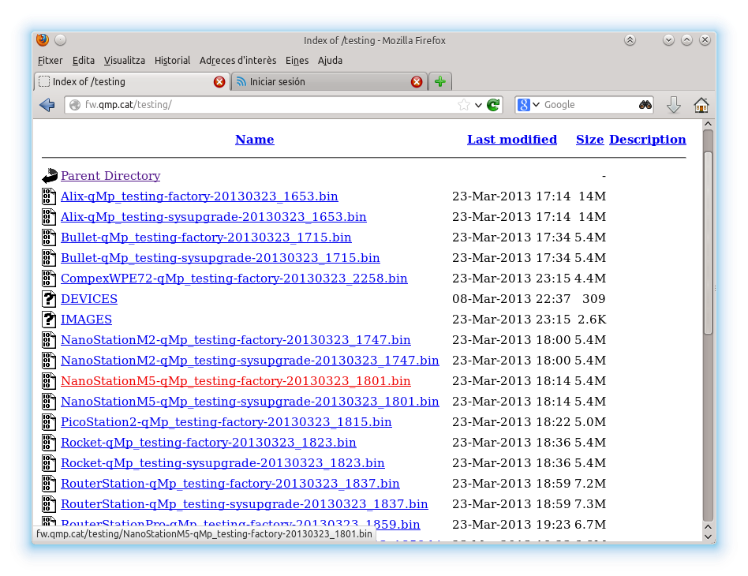

Connecteu la boca de l'antena etiquetada 'Main' amb la boca del POE etiquetada 'POE'.
Connecteu la boca del POE etiquetada 'LAN' al vostre ordinador.

Si voleu mantenir internet a l'ordinador i connectar el POE a un router,
és possible que el router hagi ficat l'ordinador a una xarxa diferent.
En aquest cas, en Linux, podeu assignar una adreça de xarxa addicional
per poder veure l'antena amb la commanda.

	ifconfig eth0:1 up 192.168.1.21 netmask 255.255.255.0

Suposant que l'adreça de fàbrica (la posa a la caixa) es 192.168.1.XX.

Un cop connectats accediu a l'adreça que diu a la caixa de l'antena,
normalment http://192.168.1.20 .

Valideu amb l'usuari i la password que tambe posen a la caixa.
Normalment, son les que surten a la pantallada (la password és igual que l'usuari).

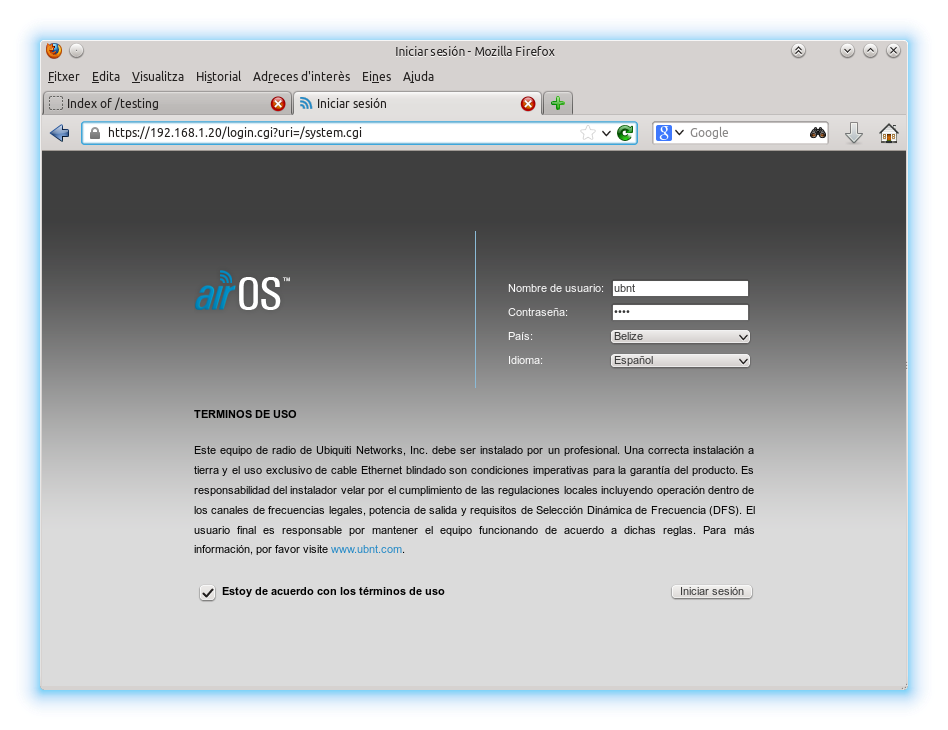

Un cop a dins, anem a la pestanya "System" i clickeu al boto "Navega" al lado de "Subir Firware".
Escull el fitxer que has baixat.

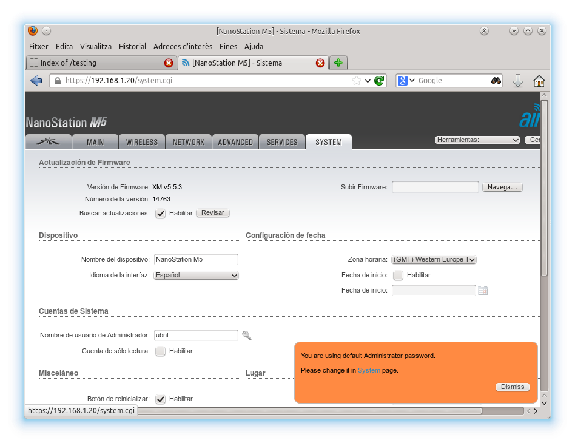

Després de pujar la imatge, et surtirà aquest advertiment culpidor.
Com no podem saber si funcionarà fins que ho provem, clicka a "Actualizar".

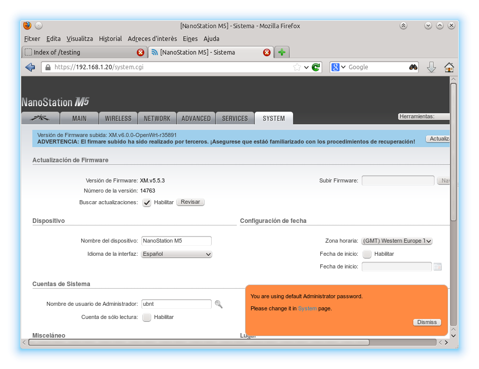

Ens surt aquesta barra de progrés, perque preguis a santa Endesa del Monopolio perqué no s'ens vagi la llum a mitges.

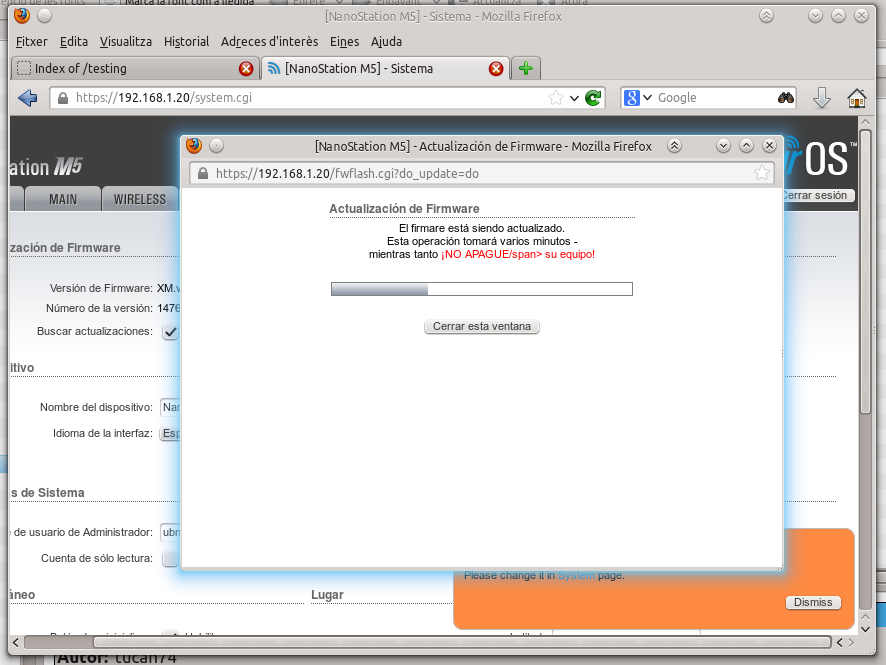

La càrrega triga poquet i, quan l'antena es reinicia, el navegador donara un error de que no hi ha xarxa.
És normal.

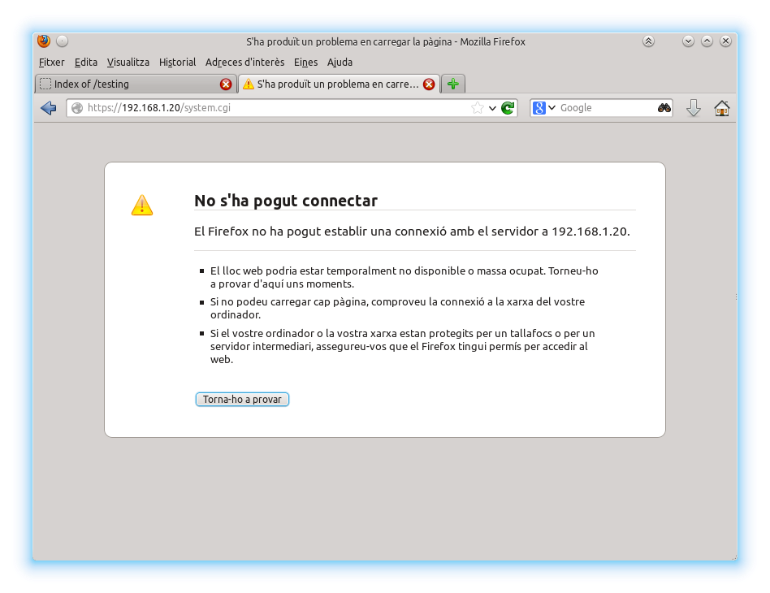

Instaŀlar qMp canvia l'adreça de l'antena.
Ara ens hem de connectar a http://172.30.22.1 .
Per veure-la has d'estar a la mateixa xarxa.
Cap problema si no estas a una xarxa local,
Com a molt, desconnectes el cable i el tornes a connectar i
l'antena donarà a l'ordinador una adreça de la seva xarxa.

A Linux hi ha un truc per no haver-te de desconnectar a Internet:
afegir una segona adreça virtual a la targeta de xarxa amb la comanda:

	ifconfig eth0:1 up 172.30.22.20 netmask 255.255.255.0

Usuari 'root', contrasenya, pregunta als altres guifibaixeros.

Un cop a dintre sortira la pantalla principal de qMp:

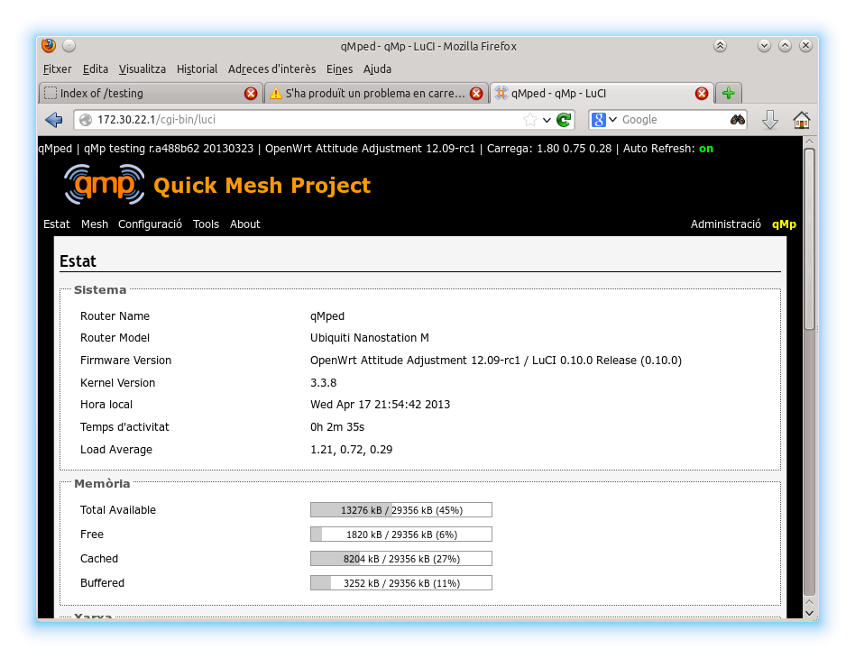

TODO: Cal explicar com canviar la password com la primera cosa a fer.

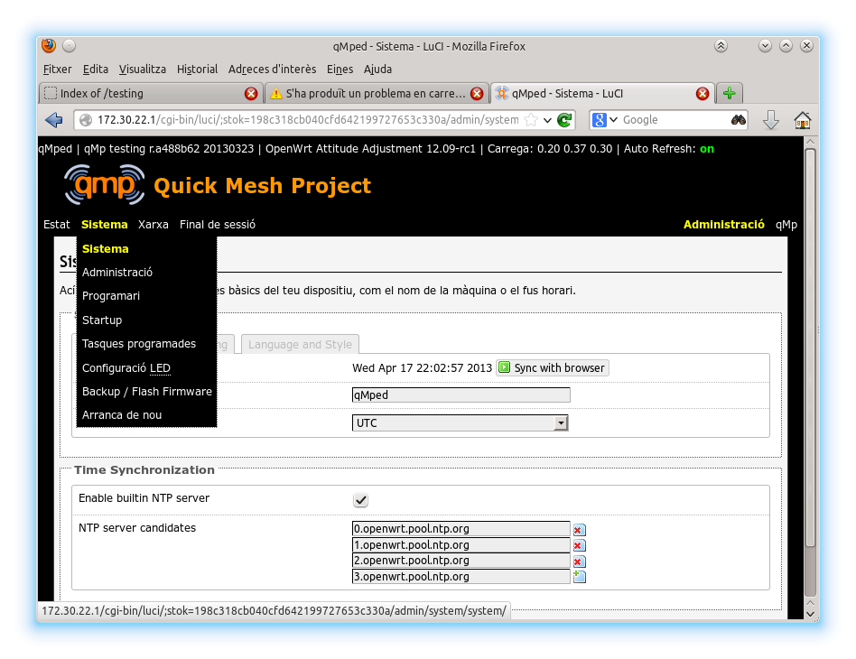
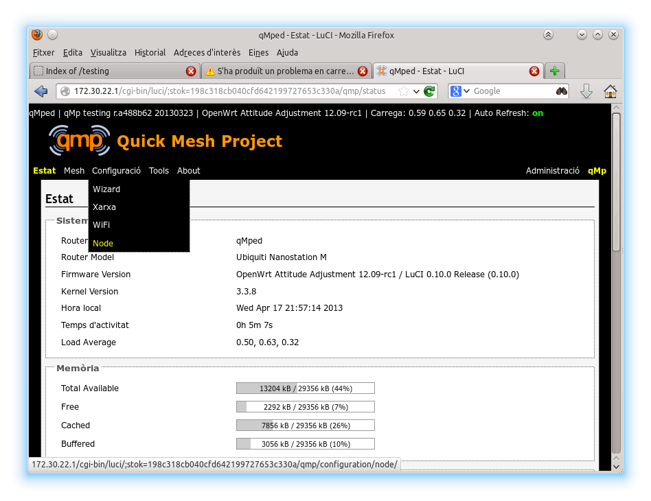
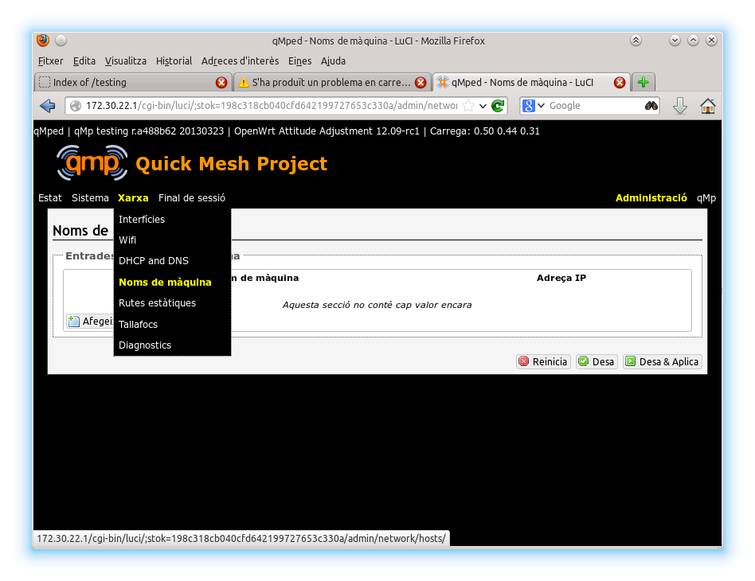
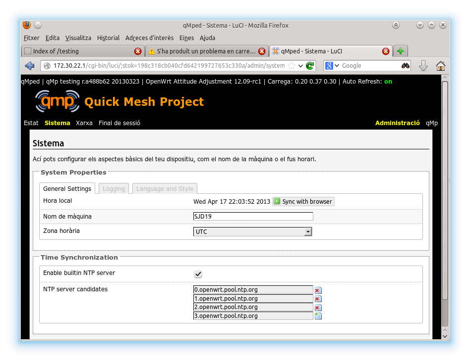
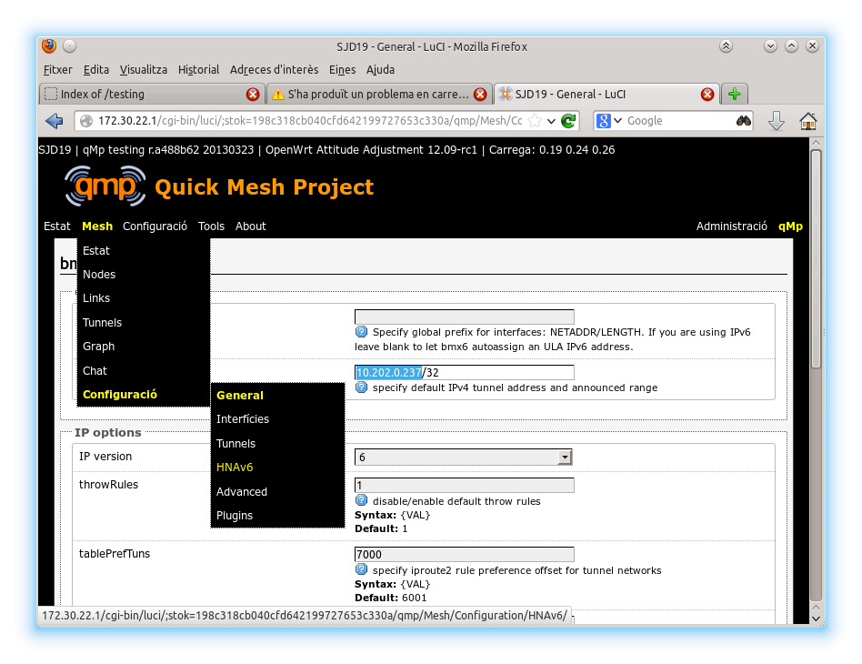
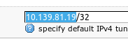
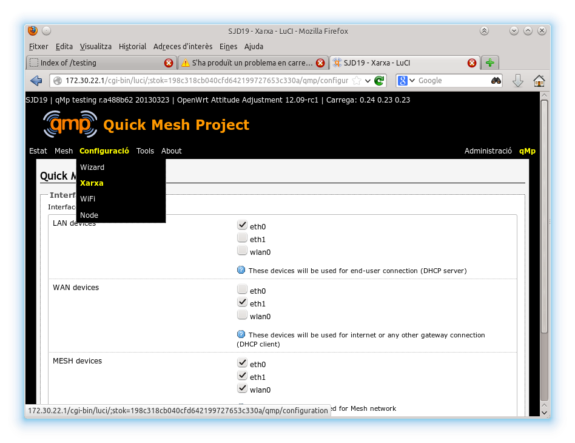
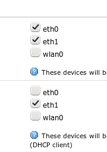

TODO: Si tot va malament com resetejar a l'estat de fàbrica.

