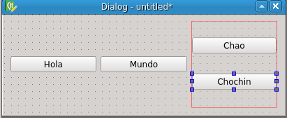
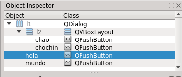

# Programación: Interfícies gràficas de escritorio

## Interfícies gràficas

La interfície de usuario es la forma en que un programa deja interactuar al usuario con él.

- **CLI (Comand Line Interface):** pe. `git`, `grep`
	- Se pueden teclear en la consola
	- Usan intensivamente los parametros de línia de comandos
	- Pensados para combinarse en scripts y usando tuberías
- **TUI (Text based User Interface):** pe. `htop`, `tig`, `aptitude`,
	- Tambien son de consola de texto pero estan pensados para su uso interactivo.
	- Una vez que se lanza el usuario puede controlarlo
	- Combinaciones de teclas -> Comandos
	- Visualizacion estructurada, paneles, menus...
- **GUI (Graphical User Interface):** pe. `qgit`, `kdiff3`...
	- **Son las que tocaremos ahora**
	- Ventanas, botones, menús...
- **WUI (Web-based User Interface):** pe. github, bitbucket, gitlab, mediateca, facebook...
	- Se ejecutan en un servidor
	- Se visualizan desde un navegador
	- Basados en HTML+CSS+Javascript+Scripts de servidor

No es una clasificación absoluta:

- Un programa puede ofecer varias formas de interactuar.
	- Ejemplo: Puedes usar la CLI del Inkscape (que normalmente usas como GUI) para exportar un SVG's como PNG o PDF.
- Muchos GUI/TUI/WUI llaman a CLI por detras.
	- Ejemplo: `aptitude` llama a una pleyade de comandos CLI `apt` (compruebalo con el htop en modo arbol)
- La funcionalidad común de varios programas suele agruparse en librerias de funciones
	- Si ofrecemos diferentes interficies tipo GUI, TUI y WUI para acceder a una misma funcionalidad, acabaremos haciendo una libreria con la funcionalidad comun
		- Ejemplo: `libgit`, `libapt`

## La libreria Qt

Qt es una [librería] de programación para hacer interficies gráficas.

- Programada en C++ pero existen adaptadores para usarla desde otros lenguajes
- Para Python hay dos adaptadores: PySide y PyQt
- Nosotros usamos PySide para el `suro` así que la formación la haremos con PySide
	- `sudo apt-get install python3-pyside`
- La ultima version de Qt es 5.x, pero usamos la 4.x porque no hay PySide para Qt5
- El codigo con PyQt es muy parecido al codigo con PySide, cambian los imports y poca cosa más
- Documentacion
	- Qt: [http://docs.qt.io/](http://docs.qt.io/)
	- PySide: [http://pyside.github.io/docs/pyside/](http://pyside.github.io/docs/pyside/)
	- La documentacion de Qt explica mejor las clases, pero el codigo de ejemplo esta en C++
- Los ejemplos estarán en Python 3

[librería]:(código ya hecho, listo para usar y reusar en diversos programas)

## Programa Python mínimo en Qt

Ejercicio: Crea este script y ejecutalo

~~~~ {.python}
	#!/usr/bin/env python3
	from PySide import QtGui
	
	app = QtGui.QApplication([])
	w = QtGui.QDialog()
	w.show()
	app.exec_()
~~~~

En este programilla ya hay bastante teca que explicar:

### Módulos y clases

- Repasamos conceptos que ya conocemos: clases y modulos/paquetes
- Se importa el módulo `QtGui` de dentro de la libreria `PySide`
	- Culturilla: Las Qt son extensas y los modulos sirven para que
	una applicación no tenga que arrastrarlas enteras,
	solo las pijadas que necesite:
		- Interficie gráfica (QtGui)
		- Multimedia (QtMultimedia)
		- Graficos 3D (QtOpenGl)
		- Redes (QtNetwork)
		- Sensores (QtMobile)
		- Navegacion web (QtWebKit)
		- Bases de datos (QtSql)
		- ...
- `QApplication` y `QDialog` son [clases] definidas dentro del modulo `QtGui`
- Creamos instancias de esas clases llamándolas con los paréntesis como si fueran una función.
- Al `QApplication` se le pasa una lista vacía `[]` o `sys.argv`

### Orientacion a eventos

- Una vez creados los objetos llamamos:
	- Al metodo `show()` del dialogo, para que muestre el dialogo que hemos construido
	- Al metodo `exec_()` de la aplicacion, para que empiece el bucle de eventos
- Casi todo el tiempo la aplicacion lo pasa dentro del `exec_`
- El `exec_` es un bucle que espera eventos y, según el evento que suceda, llama a unas partes o otras de nuestro programa
- Tenemos que definir la interficie y como reaccionara a esos eventos antes de entrar en el `exec_`
- Antes de entrar en el `exec_` tenemos que haber definido como es nuestra interficie y como responder a esos eventos
	- Culturilla: Esto se llama 'Orientacion a eventos'
- La libreria Qt proporciona ese bucle de eventos y las respuestas mas comunes
	- Nosotros solo tenemos que programar las respuestas específicas de nuestra aplicación
- En este caso hemos creado un dialogo vacio `QDialog`
	- El dialogo ya sabe como responder a algunos eventos.
	- Por ejemplo si pulsamos a la tecla ESC, el dialogo se cierra.
	- Como es nuestra unica ventana, al cerrarse, se acaba la aplicacion.

## El Qt Designer

Designer: Herramienta gráfica para editar interfícies

- Instalacion: `sudo apt-get install qt4-designer`
- Construyes una interfície arrastrando elementos gráficos
- Graba un XML que describe la interficie
- Despues, hay utilidades que, a partir de ese XML, generan código C++, Python...
- pyside-uic: El generador de codigo python para PySide
	- `sudo apt-get install pyside-tools`
- Veremos como usar ese código más adelante

- En el centro tenemos la interficie que editamos
	- Puede ser tipo:
		- Dialogo: ventana que pregunta datos y que podemos aceptar o cancelar
		- MainWindow: ventana con menus, barra de herramientas...
		- Widget: composicion de widgets basicos que podemos insertar en bloque en otra interfície
- La editamos via los diferentes paneles laterales:
	- Widget box: Los tipos de elementos, podemos arrastrarlos a la interficie
	- Object inspector: el arbol de composicion (estructura) de la interficie
	- Property editor: permite cambiar propiedades de los elementos
	- Resource Browser: Sirve para incrustar iconos e imagenes en el programa

Ejercicio:

- Crea un dialogo en designer y arrastrale elementos gráficos desde el 'widget box'
- Puedes probar el dialogo con `Control+R`

## Widgets y propiedades

- **Widget:** Elemento gràfico: boton, checkbox. radiobutton, campo de edicion, dialogo, listas...
	- Cada uno de los elementos del panel izquierdo del designer
	- TODO: Añadir imagenes (pero bueno, para eso tienes el designer)
	- Cada tipo de widget se corresponde con una clase.
		- Ejemplo: PushButton -> QtGui.QPushButton
		- La mayoria de widgets estan en PySide.QtGui y empiezan por 'Q'.
	- Ejercicio: Explora los widgets que aun no hayas probado en el Designer
- **Propiedades:** atributos que podemos consultar y/o cambiar de los widgets
	- Color, numero de opciones, tamaño, si esta habilitado, tipo...
	- Via designer con el panel de propiedades
	- Via programacion con funciones:
		- Si la propiedad se llama `unaPropiedad`
		- Se cambia con: `widget.setUnaPropiedad(nuevoValor)`
		- Se consulta con: `valor = widget.unaPropiedad()`
		- Si es booleano:
			- la consulta es `widget.isProperty()`, por ejemplo, `widget.isEmpty()`, para que se lea natural en las condiciones `if` i `while`
			- normalmente proporcionan uno y el contrario `isEnabled()` i `isDisabled`

- Ejercicio:
	- En el designer arrastra un PushButton a la interficie
	- Selecciona el PushButton, apareceran sus propiedades en el `Property editor`
	- Cambia la propiedad `text`
	- Cambia la propiedad `checkable`
	- si ejecutas (control+R) veras que ahora se queda pulsado y hay que pulsarlo otra vez para despulsarlo
	- Trastea con otras propiedades y otros widgets

## Composicion y layouts

- Composición: Unos elementos contienen a otros formando un arbol
- Widgets contenedores: los que pueden contener a otros
	- Raiz, acaban siendo una ventana: QDialog, QMainWindow...
	- Intermedios, sirven para agrupar: QFrame, QWidget...
- Layout (Distribuidor espacial): Politica de reparto del espacio del contenedor entre los widgets hijos
	- QHBoxLayout: Apilan los widgets horizontalmente
	- QVBoxLayout: Apilan los widgets verticalmente
	- QGridLayout: Distribuye en forma de tabla en filas y columnas
	- QFormLayout: Distribuye verticalmente filas de etiqueta y editor tipico de los formularios

- Ejercicio:
	- Selecciona varios widgets y clicka a los distintos botones de layout
	- Previsualiza el dialogo con control+R y cambia el tamaño de la ventana
	- Rompe el ultimo layout (el boton con el prohibido encima de un layout)
	- Selecciona el fondo del dialogo y clicka a esos mismos botones
	- Previsualiza el dialogo con control+R y cambia el tamaño de la ventana

- Moraleja: Es distinto
	- asignar un layout a un contenedor
	- que agrupar hijos en un layout
	- lo segundo no se expande con el contenedor.
	- Asigna siempre un layout a los contenedores

- Con código (ignoro la parte de crear la QApplication al principio y llamar `exec_` al final):

	~~~~ {.python}
		# Creamos los objetos
		contenedor = QDialog()
		l = QHBoxLayout()
		l2 = QVBoxLayout()
		hola = QPushButton('Hola')
		mundo = QPushButton('Mundo')
		chao = QPushButton('Chao')
		chochin = QPushButton('Chochin')

		# Organizamos la estructura
		contenedor.setLayout(l)
		l.addWidget(hola)
		l.addWidget(mundo)
		l.addLayout(l2)
		l2.addWidget(chao)
		l2.addWidget(chochin)

		contenedor.show()
	~~~~

- Ejercicio:
	- Intenta reproducir la misma estructura con el designer
	- Vuelca cuatro botones en el dialogo
	- Selecciona 2 de ellos
		- Arrastrando un cuadro de seleccion
		- O bien clicando uno despues del otro con la tecla control pulsada
	- Pulsa el botón de layout vertical
	- Clicka en el fondo del dialogo y clicka al botón de layout horizontal
	- Los dos botones que quedan y el layout vertical donde estan los otros dos, se adaptaran a la ventana repartiendose verticalmente

- Hemos usado los layouts de dos formas, una para simplemente agrupar y otra para determinar el layout del contenedor.
- Importante: Si queremos que los widgets se adapten al tamaño del contenedor hay que ponerle siempre un layout.

- Ejercicio:
	- En el _object inspector_ podemos ver la estructura
	- Los nombres no seran iguales que en la imagen de abajo, puedes cambiarlos haciendo doble click o cambiando la propiedad `name`

	   

	

## Signals y slots

- Signals: la forma que tienen los widgets de notificar cosas que les pasan al resto del programa
	- Boton: he sido pulsado!
	- Ventana: Me han cambiado de tamaño!
	- Campo texto: Me han editado!
	- Editor: Me han dejado caer un icono!
	- Mapa: Me han hecho el gesto de zoom!
	- Lista: La seleccion ha cambiado!
- Para diferenciarlo de las propiedades, normalmente se llaman con un participio (checked, resized, edited...)
- Podemos conectar un slot a una función o método (slots) que se ejecutan cuando pasan esas cosas
- Con el designer con la herramienta "Editor de signal/slot"
	- Solo se pueden conectar a slots predefinidos en los otros widgets
	- Arrastra un widget a otro y despues especificas que signal conectas con que slot
	- Programando en Python, no estamos limitados a estos slots predefinidos
	- Ejercicio:
		- Arrastra un QCheckBox, un QPushButton y un QLineEdit a un dialogo vacio
		- Conecta el CheckBox con el LineEdit para que el LineEdit no sea editable (disable) cuando el checkbox este checkeado (checked)
		- Conecta el push button para que cuando se pulse (triggered) el LineEdit se vacie (clear)
		- Prueba el diálogo

	- Con código:

		~~~~ {.python}
			check = QCheckBox("Deshabilita")
			lineEdit = QLineEdit("Valor inicial")
			button = QPushButton("Limpia")
			for child in check, lineEdit, button:
				l.addWidget(child)
			
			check.toggled.connect(lineEdit.setDisabled)
			button.triggered.connect(lineEdit.clear)
		~~~~

	- Nota: No llamamos a `clear` usando los `()`, le pasamos la funcion al signal para que la llame ella cuando toque
	- Si lo hacemos con codigo, no estamos limitados a los slots predefinidos
	- Podemos hacer que disparen nuestros metodos o funciones:
		- `button.triggered.connect(miSlot)` <- a una funcion libre
		- `button.triggered.connect(miInstancia.miSlot)` <- a un metodo de un objeto python

## Heréncia

- La herència permite definir una clase respecto a otra
- Una subclase o clase derivada, hereda todo lo que tiene y hace una clase base o superclase y añade sus cosas especificas.
- Ejemplo: La superclase Animal incluye las subclases Gato, Humano, Pajaro.
- Todos los atributos y métodos comunes a todos los animales los definimos en Animal
- Cada subclase define o redefine las cosas especificas de cada una

- Un ejemplo más informático:
	- QWidget es la clase base de todos los elementos define cosas como:
		- Propiedades: nombre, tamaño, posicion, hijos...
		- Metodos: resize, paint, setEnabled...
	- Un PushButton coge todo lo de Widget y añade:
		- Tiene una propiedad `text` para el texto del botón
		- Sabe como dibujar sus bordes
		- Cambia sus bordes cuando lo pulsas, emite las señales de triggered cuando lo haces
	- Hay otros elementos con comportamiento similar pero que se pintan diferente
		- QCheckBox, QToolButton, QRadioButton...
		- Para ello se interpone una clase intermedia que tiene todo lo comun de los botones QAbstractButton
		- Abstract porque no existe ningun objeto que sea solo QAbstractButton
		- Igual que no hay ningun animal que sea solo animal

- Observa en el Designer como las propiedades estan ordenadas por la clase en la que se definen
	- Las mas específicas estan abajo del todo
	- QObject <- QWidget <- QAbstractButton <- QPushButton
- Porque va bien la heréncia?
	- Como programador de las clases, nos ahorra mucho trabajo duplicado
	- Como usuario de las clases, agrupamos conceptos:
		- si ya sabemos como va un QPushButton, sabemos que comparte cosas con un QRadioButton
- En la documentacion, cada clase documenta lo que añade y enlaza a lo que recibe de sus superclases
	- Propiedades
	- Signals
	- Slots
	- Metodos

- Nosotros podemos derivar nuestros propios widgets personalizados
	- A base de combinar widgets bàsicos (lo normal)
	- O pintando uno desde cero
- Lo típico es derivar QDialog o QMainWindow para hacer nuestro dialogo o ventana principal específica

	~~~~ {.python}
	class MiDialogo(QDialog) :
	
		def __init__(self):
			# Nuestro constructor llama al de la super clase
			# para que inicialice sus cosas
			super(MiDialogo, self).__init__()

			# Y aqui inicializariamos las nuestras
			# llenandonos de widgets, fijando layouts...
	~~~~

- De esta manera podemos tener lo que antes pero podemos reusarlo como clase (podemos instanciarla varias veces)

	~~~~ {.python}
	w = MiDialogo()
	w2 = MiDialogo()
	w.show()
	w2.show()
	~~~~

## Modelo-Vista-Controlador

Separamos las responsabilidades:

- Por un lado esta el objeto **modelo** que contiene los datos del negocio
- Por otro lado esta la **vista** que contiene lo que esta editando el usuario
- Un tercer elemento es el que se encarga de pasar la información de un lado a otro

### Ejemplo

Creemos un dialogo que edite un objeto cliente, que será nuestro modelo.

- El modelo será un objeto de tipo `namespace` de los que ya vimos.
- Se lo pasaremos al constructor del diálogo para rellenar los campos.
- Los widgets del dialogo, contienen los valores editados por el usuario (son la vista)
- Cuando aceptemos el diálogo aplicamos los valores de la vista al modelo.
- Si cancelamos el diálogo no los aplicamos.

	~~~~ {.python}
	#!/usr/bin/env python3

	from PySide import QtGui

	class EditorDatos(QtGui.QDialog):

		def __init__(self, cliente):
			super(EditorDatos, self).__init__()

			# Nos guardamos una referencia al modelo
			self.cliente = cliente

			# Creamos la estructura de widgets

			layout = QtGui.QFormLayout()
			self.setLayout(layout)

			# Nos guardamos el widget como atributo para poder acceder luego
			self.nameEditor = QtGui.QLineEdit(self.cliente.name)
			layout.addRow('Nombre', self.nameEditor)

			# La botonera estandard con un par de botones estandard
			buttons = QtGui.QDialogButtonBox(
				QtGui.QDialogButtonBox.Ok |
				QtGui.QDialogButtonBox.Cancel |
				0)
			layout.addRow(buttons)

			# Interaccion

			buttons.accepted.connect(self.onAccepted)
			buttons.rejected.connect(self.reject)

		def onAccepted(self):
			# Aplicamos el cambio al modelo
			self.cliente.name = self.nameEditor.text()

			# Al final acceptamos el dialogo (opuesto a 'reject')
			self.accept()

	from namespace import namespace as ns

	app = QApplication([])

	# Creamos el modelo
	datosCliente = ns()
	datosCliente.name = 'Perico Palotes'
	datosCliente.address = 'Percebe, 13'
	datosCliente.nif = '12345678Z'

	# Creamos el widget
	editor = EditorDatos(datosCliente)
	editor.show()

	app.exec_()

	print(datosCliente)

	~~~~

**Ejercicio:**

1. Prueba el programa anterior. ¿Que ves en la consola cuando editas y pulsas a cancelar? ¿Y si pulsas a aceptar? ¿porqué?
1. Modifica el script anterior para que también se editen la dirección y el identificador fiscal.
1. Modifica el script anterior para que los datos se cargen de un fichero
	- Pista: `datosCliente = ns.load('cliente.yaml')`
1. Modifica el script anterior para que el fichero de entrada se especifique por linea de comandos.
	- Pista: `ficheroDeEntrada = sys.argv[1]`
1. Modifica el script para que si no le pasas este argumento, se cree un dato por defecto, como hacía antes.
	- Pista: Si no hay argumentos `len(sys.argv)<=1`, recuerda que `sys.argv[0]` es el nombre del programa.
1. Modifica el script para que cuando se acepte el dialogo, se escriba el nuevo objeto en el fichero.
	- Pista: Hay que hacerlo despues del `exec_`
	- Pista: Para saber si se ha aceptado: `editor.result() == QtGui.QDialog.Accepted`
	- Atención: Fijate que `Accepted` en mayuscula es una constante, `accepted` en minúsculas es un _signal_
	- Pista: Para guardar el yaml: `datosCliente.dump(nombreFichero)`
	- Atención: Si no nos han pasado `nombreFichero` qué hacemos?

### Validación de datos

- No todos los NIF son válidos
- Para validar un nif: stdnum.es.nif.isValid("xxxxx")
	- `sudo apt-get install python3-stdnum`
- Mientras que no sea válido, no aplicamos el valor al modelo

	~~~~{.python}
		def __init__(self, cliente):
			(...)
			self.nifEditor.edited.connect(self.onNifEdited)
			self.nifEditorNormalStyle = self.nifEditor.styleSheet()
			self.nifEditorErrorStyle = "border: 1px solid red;"
			(...)

		def onNifEdited(self):
			newNif = self.nifEditor.text()
			if stdnum.es.nif.isValid(newNif):
				self.nifEditor.setStyleSheet(self.nifEditorNormalStyle)
				self.buttons.getButton(QtGui.QDialogButtonBox.Ok).setEnabled()
			else:
				self.nifEditor.setStyleSheet(self.nifEditorErrorStyle)
				self.buttons.button(QtGui.QDialogButtonBox.Ok).setDisabled()

		def onAccepted(self):
			(...)
			# Comprobamos que los campos sean correctos
			newNif = self.nifEditor.text()
			if stdnum.es.nif.isValid(newNif):
				return
			(...)
			# Aplicamos los campos al modelo
			self.cliente.nif = newNif
			(...)
			# Al final acceptamos el dialogo (opuesto a 'reject')
			self.accept()
	~~~~

### Editando campos tipo fecha

**Ejercicio:**

1. Añade un campo `birth` al YAML para poner el dia de nacimiento
2. Añade al dialogo un widget `QDateEdit` para editarlo
3. Rellenalo con el dato del `namespace` (busca el mètodo correspondiente en la documentación de la clase)
4. Cuando aceptes el diálogo, toma el valor del widget con el método que tambien encuentres en la documentación.

El `QDateEdit` no está mal, ¿pero a que molaría seleccionar la fecha en un calendario?

**Para nota:** Edita la fecha con una combinacion de botones para saltar de mes y año y un `QCalendarWidget`.

## Generación dinàmica de interfícies

Sería muy util que el diálogo se adaptara a los campos que tenemos en el YAML.
En los siguientes, apartados vamos a ir montando un editor genérico de YAML's.

### Editor de un campo YAML

Como decía Jack el Destripador, vayamos por partes.

Hemos visto en el diálogo de arriba que para cada campo del `namespace`
hay que hacer siempre lo mismo:

- Inicializar el widget con el valor del modelo
- Validar el valor del widget
- Aplicar el valor del widget al modelo

Hagamos una estructura que dado un `namespace` y un nombre de atributo,
sepa hacer dicho teje maneje.

~~~~ {.python}
class NsTextEditor(QtGui.QWidget):

	def __init__(self, data, attributeName):

		# Como siempre llamamos al __init__ de la superclase
		super(NsTextEditor, self).__init__()

		self.data = data
		self.attributeName = attributeName

		# Un QWidget es un contenedor que no es ventana como QMainWindow o QDialog
		# Como es un contenedor, necesitamos un layout para disponer los hijos
		l = QtGui.QHBoxLayout()
		self.setLayout(l)

		# Como no conocemos el nombre no podemos usar la sintaxis '.'
		valorInicial = data[attributeName]
		self.editor = QLineEdit(valorInicial)
		l.addWidget(self.editor)

	def apply(self):
		self.data[self.attributeName] = self.editor.text()
~~~~

Ahora podemos construir un dialogo generico con el siguiente código:

~~~{.python}
class EditorDatos(QtGui.QDialog):

	def __init__(self, data):

		# Siempre llamamos al super
		super(EditorDatos, self).__init__()

		# Nos guardamos una referencia al modelo
		self.data = data

		# Creamos la estructura de widgets
		layout = QtGui.QFormLayout()
		self.setLayout(layout)

		# Nos construimos una lista con los editores de campo
		self.editors = []
		for name in self.data:
			editor = NsTextEditor(self.data, name)
			layout.addRow(name, editor)
			self.editors.append(editor)

		# La botonera estandard con un par de botones estandard
		buttons = QtGui.QDialogButtonBox(
			QtGui.QDialogButtonBox.Ok |
			QtGui.QDialogButtonBox.Cancel |
			0)
		layout.addRow(buttons)

		# Interaccion

		buttons.accepted.connect(self.onAccepted)
		buttons.rejected.connect(self.reject)

	def onAccepted(self):
		# Aplicamos el cambio al modelo, pero ahora via el editor
		for editor in self.editors:
			editor.apply()

		# Al final acceptamos el dialogo (opuesto a 'reject')
		self.accept()
~~~~

Si lo ejecutamos, vemos que hemos perdido dos cosas:

- Tenemos que quitar el campo `birth` porque un `QLineEdit` trabaja con textos no con fechas.
- Hemos perdido la validacion del `nif`.

De momento, para probar, quitemos el campo `birth` de la entrada.

### Soportando tipos no esperados

Primer paso, en el caso en que tengamos un valor de tipo no esperado,
vamos simplemente a enseñarlo sin dejarlo editar.

- Vamos a convertir el valor a string con `str`
- Vamos a crear un `QLabel` (Enseña un texto no editable)

~~~{.python}
class NsNoEditor(QtGui.QWidget):
		# Como siempre llamamos al __init__ de la superclase
		super(NsNoEditor, self).__init__()

		self.data = data
		self.attributeName = attributeName

		# Un QWidget es un contenedor que no es ventana como QMainWindow o QDialog
		# Como es un contenedor, necesitamos un layout para disponer los hijos
		l = QtGui.QHBoxLayout()
		self.setLayout(l)

		# Como no conocemos el nombre no podemos usar la sintaxis '.'
		valorInicial = data[attributeName]
		self.editor = QtGui.QLabel(str(valorInicial))
		l.addWidget(self.editor)

	def apply(self):
		# Es un dato que no conocemos, lo dejamos como està
		pass

class EditorDatos(QtGui.QDialog):
	(...)
	def __init__(self, data):
		(...)
		# Nos construimos una lista con los editores de campo
		self.editors = []
		for name in self.data:
			attributeType = type(self.data[name])
			if attributeType is str:
				editor = NsTextEditor(self.data, name)
			else:
				editor = NsNoEditor(self.data, name)
			layout.addRow(name, editor)
			self.editors.append(editor)
		(...)

	(...)
~~~

### Don't repeat yourself (Refactorizando para tener herencia)

Vemos que `NsTextEditor` y `NsNoEditor` comparten mucho código.
La máxima de todo programador es _No te repitas_.
Veremos lo útil que es la herencia para eliminar esa duplicación.

- Identificamos lo común y lo diferente.
	- Lo común es casi todo
	- Lo diferente, el `apply` y la linea que crea el editor
- Separamos lo diferente:
	- Extraemos un metodo que cree el editor `createEditor`
	- El apply ya esta separado
- Movemos lo comun a la clase base

~~~{.python}

class NsFieldEditor(QWidget):
	def __init__(self, data, attributeName):
		# Como siempre llamamos al __init__ de la superclase
		super(NsFieldEditor, self).__init__()

		self.data = data
		self.attributeName = attributeName

		# Un QWidget es un contenedor que no es ventana como QMainWindow o QDialog
		# Como es un contenedor, necesitamos un layout para disponer los hijos
		l = QtGui.QHBoxLayout()
		self.setLayout(l)

		# Como no conocemos el nombre no podemos usar la sintaxis '.'
		valorInicial = data[attributeName]
		# Delegamos en el metodo createEditor
		self.editor = self.createEditor(valorInicial)
		l.addWidget(self.editor)

	def createEditor(self, valorInicial):
		# Nos aseguramos de que no se use la clase base, sino las derivadas
		# y que las derivadas implementan el metodo
		raise NotImplemented()

	def apply(self):
		# Lo mismo que con createEditor
		raise NotImplemented()

class NsNoEditor(NsFieldEditor)
	def __init__(self, data, attributeName):
		# Seguimos llamando a la base que ahora es NsFieldEditor
		super(NsNoEditor, self).__init__(data, attributeName)

	def createEditor(self, valorInicial):
		return QtGui.QLabel(str(valorInicial))

	def apply(self):
		pass

class NsTextEditor(NsFieldEditor)
	def __init__(self, data, attributeName):
		# Seguimos llamando a la base que ahora es NsFieldEditor
		super(NsNoEditor, self).__init__(data, attributeName)

	def createEditor(self, valorInicial):
		return QLineEdit(valorInicial)

	def apply(self):
		self.data[self.attributeName] = self.editor.text()
~~~

El método `createEditor` es lo que se viene a llamar un _método factoría_,
un método que retorna un objeto nuevo.
Al definirlo así, las subclases pueden redefinir el tipo de objeto que se devuelve.

### Volviendo a soportar fechas

~~~{.python}
class NsDateEditor(NsFieldEditor)
	def __init__(self, data, attributeName):
		# Seguimos llamando a la base que ahora es NsFieldEditor
		super(NsDateEditor, self).__init__(data, attributeName)

	def createEditor(self, valorInicial):
		return QDateEdit(valorInicial)

	def apply(self):
		# Lo convertimos en nuestro tipo, más util, `dateutils.Date`
		self.data[self.attributeName] = dateutils.Date(self.editor.date())

class EditorDatos(QtGui.QDialog):
	(...)
	def __init__(self, data):
		(...)
		# Nos construimos una lista con los editores de campo
		self.editors = []
		for name in self.data:
			attributeType = type(self.data[name])
			if attributeType is str:
				editor = NsTextEditor(self.data, name)
			elif attributeType in (dateutils.Date, datetime.date):
				editor = NsDateEditor(self.data, name)
			else:
				editor = NsNoEditor(self.data, name)
			(...)
~~~

### Aprovechando la herencia de diferentes maneras

Recuperemos la validación de NIFs creando una nueva clase.

- Derivaremos de `NsTextEditor` para reaprovechar su código
- Crearemos un nuevo método para validar a redefinir en las subclases
- Esta vez daremos una implementación por defecto
- Cuando el usuario acepte el diálogo, antes de aplicar, miraremos si los campos validan

~~~{.python}
class NsFieldEditor(QWidget):
	(...)
	def isValid(self):
		# Si la clase derivada no lo redefine, siempre valida
		# Así no tenemos que definir el método en NsTextEditor y NsDateEditor
		# Solo donde la validación pueda fallar
		return True

class NsNifEditor(NsTextEditor)
	def __init__(self, data, attributeName):
		# Seguimos llamando a la base que ahora es NsFieldEditor
		super(NsNifEditor, self).__init__(data, attributeName)a

		self.editor.edited.connect(self.onEdited)
		self.normalStyle = self.editor.styleSheet()
		self.errorStyle = "border: 1px solid red;"

	def onEdited(self):
		newNif = self.editor.text()
		if stdnum.es.nif.isValid(newNif):
			self.editor.setStyleSheet(self.nifEditorNormalStyle)
		else:
			self.editor.setStyleSheet(self.nifEditorErrorStyle)

	# tomamos el apply y el createEditor de NsTextEditor

	def isValid(self):
		return stdnum.es.nif.isValid(self.editor.text())

class EditorDatos(QtGui.QDialog):
	(...)
	def __init__(self, data):
		(...)
		# Nos construimos una lista con los editores de campo
		self.editors = []
		for name in self.data:
			attributeType = type(self.data[name])
			if attributeType is str:
				if attributeName == 'nif' :
					editor = NsNifEditor(self.data, name)
				else:
					editor = NsTextEditor(self.data, name)
			elif attributeType in (dateutils.Date, datetime.date):
				editor = NsDateEditor(self.data, name)
			else:
				editor = NsNoEditor(self.data, name)
			(...)

	def onAccepted(self):
		# Validamos todos los campos
		for editor in self.editors:
			if not editor.isValid():
				return
		# Si todos son validos, seguimos
		# Aplicamos el cambio al modelo, pero ahora via el editor
		for editor in self.editors:
			editor.apply()

		# Al final acceptamos el dialogo
		self.accept()
~~~

El diagrama de clases es una forma muy clara de ver la relación entre las clases y como se heredan atributos y métodos

TODO: Diagrama de clases resultante

Cosas que podemos aprender del código de arriba:

- Si un método no se define en la derivada (subclase), se usa el que haya en la base (superclase)
	- Ejemplo: `isValid` para `NsNoEditor`, `NsDateEditor` o `NsTextEditor`, usan el de `NsFieldEditor`
	- Ejemplo: `NsNifEditor` usa `createWidget` y `apply` de `NsTextEditor`
- Si se define, entonces se usa este, en vez del método de la derivada
	- Ejemplo: `isValid` en `NsNifEditor` redefine el de  `NsFieldEditor`
	- Ejemplo: `createWidget` y `apply` se redefinen en `NsDateEditor` y `NsTextEditor`
- Si queremos hacer lo de la base y añadir más cosas, llamamos al metodo con `super` y despues hacemos lo nuestro
	- Ejemplo: Todos los constructores `__init__` llaman al `__init__` de la super clase.
- Como todos los constructores llaman los `__init__` de las superclases
	- Todos los atributos que tienen las superclases estan disponibles en las subclases
	- Ejemplo: `self.editor` lo podemos usar en el `isValid` de `NsNifEditor`.
	- **¡¡Nunca te olvides de llamar al `__init__` de la superclase!!**

