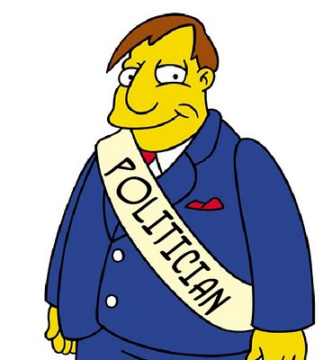
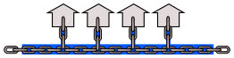
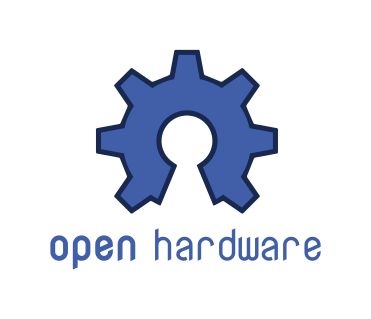
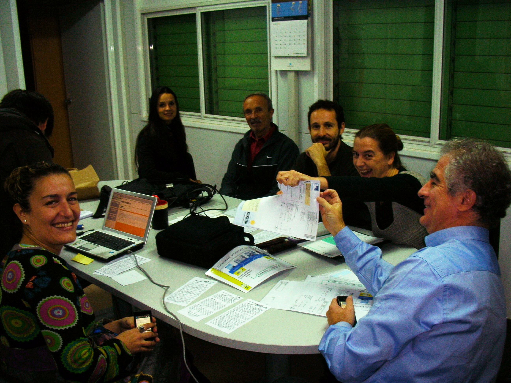
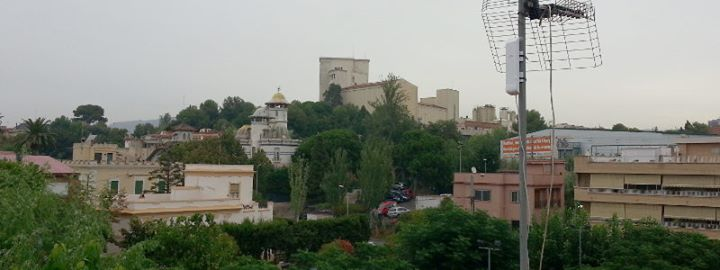
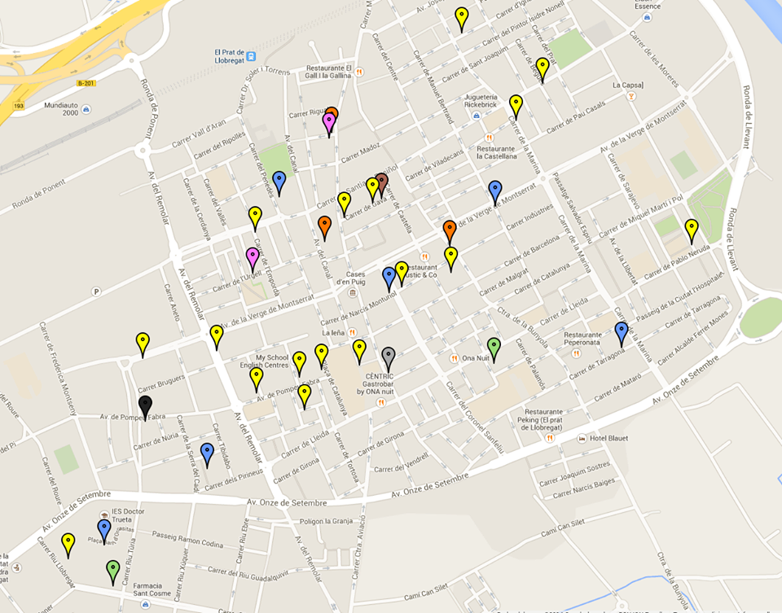

% Cooperativisme i comunicacions lliures
% Jornades Llibertàries
% David García Garzón, Guifibaix

# Qui som?

## Els barrets

----

**Cerca, difusió i construcció d'alternatives**

Campanya del 15M de Sant Joan Despí

Difusió, xerrades...

Accions de salt col·lectiu

Oberta a la col·laboració

---

**Xarxa ciutadana de comuns**

Oberta, lliure i neutra

Construida per voluntaris, empreses, administracions

Llicència viral que garanteix les regles de joc

Coordinats per una Fundació

---

<b>Cooperativa de treballadors sense anim de lucre</b>

Instal·lem i mantenim xarxes de comuns

Compartir conexions entre els veïns

Telèfon fixe i Internet fora de les grans companyies

---

**Cooperativa de consumidors**

Objectiu: Comunicacions ètiques controlades pels usuaris

Engegant, constituida al Març del 2014

Operador virtual: Comercialitza serveis de tercers

Reinverteixen projectes de comuns

# Per què ho fem?

## Els dolents

<!-- .slide: data-background="#ff0000" -->

## Els dolents

## Els dolents

## Els nostres Mr.Burns

## Per què són els dolents?

Mercats cautius, Pèssim tracte a l'usuari

Explotació laboral, Acomiadaments, ERE's

Executius amb super-sous

Evasió fiscal, Filials a paradisos fiscals

Beneficis record, Pujades de tarifes

Acullen a personatges de baixa catadura moral

Lleis fetes a mida per ells i contra nosaltres

Contaminació, degradació de l'entorn

## El teu sou

(si el tens)

<svg width=100%>

<rect x=0 y=0 width=100% height=100px style='stroke:black; fill:orange;'/>
<rect x=1% y=10 width=30% height=80px style='stroke:black; stroke-width:2;fill:darkgreen;'/>
<rect x=32% y=10 width=36% height=80px style='stroke:black; stroke-width:2;fill:darkred;'/>
<rect x=69% y=10 width=30% height=80px style='stroke:black; stroke-width:2;fill:darkblue;'/>
<text x=4% y=60px style='fill:white;'>Impostos</text>
<text x=35% y=60px style='fill:white;'>Consum Variable</text>
<text x=74% y=60px style='fill:white;'>Factures</text>
</svg>

## Mercats Cautius

## Alternatives?

Banca:

Energia:

Comunicacions:

Serveis online:

Programari:

# Perque no les fem servir?

## Les excuses

No existeix alternativa

No estan ben plantejades

Els falta massa crítica

No es coneixen

Se les menjen les grans

Por, dubte i incertesa

Peresa i resistencia al canvi

Marc legal advers

## Que no existeixen?

### **Les creem! Imaginació!**

Fins i tot a mercats cautius han sortit alternatives

&nbsp;

## Mal plantejades?

### **Participem per redreçar-les!**

Compte de no fraccionar la massa crítica!

## Massa inercia?

### **Plantejem noves alternatives**

Colaborant, sense frentismes

Aprofitant lliçons apreses

## El nostre exemple

<svg width='150' height='100'>
<path
	d='M 150 50 L 110 0 v 30 h -110 v 40 h 110 v 30 z'
	style='fill:darkred; stroke: black'
	/>

</svg>

Era massa complexe per l'usuari

Complementem guifi.net
simplificant-ho al usuari.

No dupliquem

## Les grans se les menjen?

---

### **Organització**

---

### **Viralitat**

## Resistència al canvi?

### El gran enemic: El refranyer

> Más vale malo conocido que bueno por conocer

I així ens va...

## Incertesa? Por?

Costa ben poc crear dubtes
sobre una iniciativa nova:

> Uy esos...

I la resistència al canvi fa la resta

FUD: Fear, uncertainty and doubt

## Incertesa? Por?

### Les nostres armes

Difusió social, no pas comercial

Informació honesta i sostinguda amb dades objectives

Referències de qui ha fet el salt

Acompanyament del salt, salts col·lectius

## Context legal?

### Ens enfrontem a:

Lobbies

Corrupció

Portes giratòries

Nepotisme

Exèrcits d'advocats

## Context legal?

### Les nostres armes

Hackejar la llei existent

Crear estat d'opinió

Insubmisió, desobediència

Instàncies superiors

# Què estem fent?

## Recollir informació

Recollim lo bo i lo dolent

<http://desconexionibex35.org>

## Salts col·lectius

La primera de SomEnergia a Sant Joan

...i van 4.

## Paradetes i xerrades

Difusió i demostració

## Participar

### Grups locals de la comarca

Grup Local de SomEnergia del Baix Llobregat

Grup Local de Coop57 al Baix Llobregat

Guifi.net Baix Llobregat

## I més

Promoure contactes entre la gent que ha fet el salt i la que no

Promoure alternatives on no n'hi han

Complementar les alternatives existents

## Qué falta per fer?

Cobrir molts sectors

Recopilar més informació

Difusió, difusió, difusió

Applicacions socials

Promoure-ho al vostre àmbit

### Podeu col·laborar!

# Guifibaix

## guifibaix.coop

## Objectius

Habilitar alternativa ètica
a l'actual oligopoli de les telecos

Universalizar la banda ampla d'Internet
baixant els preus actuals

Generar ocupació de qualitat
mitjançant fórmules cooperativas

## La cooperativa

Sense ànim de lucre

Els treballadors decideixen les seves condicions laborals

La xarxa pertany als usuaris

Basada en programari lliure, estàndars oberts i xarxa documentada

Servidors alimentats amb renovables

## 

Principi víric:

> Si vols passar pels altres nodes,
> has de deixar que els altres passin pel teu.

## Els nodes

## La xarxa

## Cobertura peninsular

### Més de 25.000 nodes!

## Cobertura província

## Cal professionalitzar?

Hom pot muntar i mantenir el seu node, pero calen **temps** i **coneixements tècnics**.

A l'escala que volem crèixer, voluntaris no donaríen a l'abast.

Recomanació dels voluntaris existents al poble.

## Rodalies: Sant Feliu

## Rodalies: Torrelles

## Compartició d'Internet

## Sant Joan Despí

## El Prat

## Telefonia IP

## Serveis afegits

Podem aprofitar l'ample de banda intern posant serveis interns

Molt més potent que una connexio ADSL o fibra stàndard

## Serveis: Mediateca

## Serveis afegits

P2P comunitari

Enmagatzemament i compartició al núvol

Streaming de radio i televisió

Mediateca

Centraleta

Correu

Hosting

...

## Costos de la xarxa

Sense ànim de lucre però cal cobrir:

- Instal·lació
- Manteniment
- Sortides a Internet
- Telefonia IP
- Costos d'operació
- Equipament comunitari

## Preus: Instal·lació

Cadascú es paga la seva

Depén de la complexitat de l'edifici

Típic: Entre 200€ i 290€ per veí

Es paga un sol cop

Es pot repartir en mesos

## Preus: Manteniment

**Normal:** 12'50€+IVA/mes

El mode senzill, no em preocupo d'on surt la connexió.

**Aportador:** 0€+IVA/mes

El mode necessari, aporto la meva connexió a Internet

Puc designar acompanyants, que m'ajuden a pagar-la.

Màxim 4 acompanyants amb ADSL, 7 amb Fibra

**Acompanyant:** 7'50€+IVA/mes

El mode solidari: ajudo a pagar la connexió a l'aportador

Rebo un descompte en el manteniment

## Preus: Telefonia IP

No som nosaltres: NubipTel/Eticom

Número fixe amb portabilitat: 1,58€/mes + IVA

Trucades a fixes: 1,34¢/min +IVA 

Trucades a mòvils: 4,35¢/min +IVA

## Com procedir

1. Demanar prova de connectivitat
2. Pressupost i convèncer a 3 o 4 veïns
3. Reunió amb els veïns interessats
4. Instal·lació de la xarxa i proves
5. Portabilitat del fixe (i baixa de l'oligopoli!!)

## I els veïns?

És un servei bàsic i no poden vetar la instal·lació.

Però, convé acordar:

- Enganxada de la llum a la comunitat
- Per on baixar els cables
- Pagaments mitjançant la comunitat
- Convidar a que altres veïns s'apuntin

## Doncs endavant!

Apunteu-vos per una **prova de connectivitat** sense compromís

Aneu parlant amb els veïns

&nbsp;

Més informació:

[guifibaix.coop](http://guifibaix.coop)

