% Guifibaix
% La xarxa lliure del Baix Llobregat
% David García Garzón
---
css: guifibaix.css
revealjs-transition: slide
---

# Qui som?

## Els barrets

{width=20%}
{width=20%}

{width=20%}
{width=20%}

{width=20%}

<aside class="notes">

- De fet, treballo a Som Energia
- Vinc a parlar de l'altre trebal el que no em paguen
- Guifibaix que es una Associació-cooperativa...
- Després si voleu fer preguntes concretes, també ha vingut l'Aitor

- On va començar tot?
- Al 15M a Sant Joan Despí
- Acció directa: on incidir
- Com suposo que vosaltres, vam analitzar quina era la força que ens mantenia com estàvem
- No era la policia
- No eren els polítics
- Era l'elite econòmica 
- Que en el nostre cas són aquesta penya
- No perque lo gran sigui dolent, que també
- Sino perque la majoria tenen una relacio perversa amb l'estat
- Que podem fer? doncs no alimentar-los amb els nostres diners
- Clar que no és tan fàcil

- Com vosaltres vam cercar alternativas existents
- On hi havia, les difoniem
- On no hi han, les creàvem
- On hi han però faltava, ajudàvem, complementàvem
- D'aquí el naixement de la nostra cooperativa

- En el tema de 

- Existente: guifi.net
- Problema: universalizacion
- Solucion: agente local tecnico
- Agent voluntari o profesionalitzat?
- Experiencia de Sant Joan/Molins amb voluntaris:
	- Voluntaris sobrecarregats
	- Desaparició de voluntaris (molins)
- Experiencia de Torrelles/Castelldefels amb empreses
	- Torrelles: Desaparició de l'empresa
	- Castelldefels: Canvi de paradigma fora de comuns
- Participació de l'administració
	- Benvinguda
	- No s'hi pot dependre, canvis de govern o agenda

</aside>

----

{width=50%}

**Cerca, difusió i construcció d'alternatives**

Campanya del 15M de Sant Joan Despí

Difusió, xerrades...

Accions de salt col·lectiu

Oberta a la col·laboració

---

{width=40%}

**Xarxa ciutadana de comuns**

Oberta, lliure i neutra

Construida per voluntaris, empreses, administracions

Llicència viral que garanteix les regles de joc

Coordinats per una Fundació

---

{width=30%}

**Instal·la i manté la xarxa de comuns al Baix Llobregat**

Cooperativa de treball sense ànim de lucre

(De moment constituïda com associació)

Facilita la compartició de conexions entre els veïns

Dona serveis afegits (mediateca, núvol privat...)

---

{width=40%}

**Cooperativa de consumidors**

Comunicacions ètiques controlades pels usuaris

Operador virtual: Comercialitza serveis de tercers

Mòbil (masmobil/orange) i ADSL/fibra (vodafone)

Reinverteixen en projectes de comuns

# Per què ho fem?

## Els "dolents"

## Els "dolents"

<!-- .slide: data-background="#ff0000" -->

## Els "dolents"

## Els nostres Mr.Burns

## Per què són els dolents?

Mercats cautius, Pèssim tracte a l'usuari

Explotació laboral, Acomiadaments, ERE's

Executius amb super-sous

Evasió fiscal, Filials a paradisos fiscals

Beneficis record, Pujades de tarifes

Acullen a personatges de baixa catadura moral

Lleis fetes a mida per ells i contra nosaltres

Contaminació, degradació de l'entorn

## Mercats Cautius

## El teu sou {data-transition='fade'}

(si el tens)

<svg width=100%>
<rect x=0 y=0 width=100% height=100px style='stroke:black; fill:orange;'/>
<rect x=1% y=10 width=30% height=80px style='stroke:black; stroke-width:2;fill:darkgreen;'/>
<rect x=32% y=10 width=36% height=80px style='stroke:black; stroke-width:2;fill:darkred;'/>
<rect x=69% y=10 width=30% height=80px style='stroke:black; stroke-width:2;fill:darkblue;'/>
<text x=15% y=60px style='text-anchor:middle; fill:white;'>Impostos</text>
<text x=50% y=60px style='text-anchor:middle; fill:white;'>Consum</text>
<text x=84% y=60px style='text-anchor:middle; fill:white;'>Factures</text>
</svg>

- Impostos ➡ Estat
- Factures ➡ Oligopolis
- Consum ➡ Economia productiva

## El teu sou {data-transition='fade'}

Amb la crisi...

<svg width=100%>
<rect x=5% y=0 width=90% height=100px style='stroke:black; fill:orange;'/>
<rect x=6% y=10 width=30% height=80px style='stroke:black; stroke-width:2;fill:darkgreen;'/>
<rect x=37% y=10 width=26% height=80px style='stroke:black; stroke-width:2;fill:darkred;'/>
<rect x=64% y=10 width=30% height=80px style='stroke:black; stroke-width:2;fill:darkblue;'/>
<text x=20% y=60px style='text-anchor:middle; fill:white;'>Impostos</text>
<text x=50% y=60px style='text-anchor:middle; fill:white;'>Consum</text>
<text x=80% y=60px style='text-anchor:middle; fill:white;'>Factures</text>
</svg>

- El teu sou es va reduir
- Pateix la teva capacitat de consum
- Factures i impostos no es redueixen

## El teu sou {data-transition='fade'}

...i de fet

<svg width=100%>
<rect x=5% y=0 width=90% height=100px style='stroke:black; fill:orange;'/>
<rect x=6% y=10 width=35% height=80px style='stroke:black; stroke-width:2;fill:darkgreen;'/>
<rect x=42% y=10 width=16% height=80px style='stroke:black; stroke-width:2;fill:darkred;'/>
<rect x=59% y=10 width=35% height=80px style='stroke:black; stroke-width:2;fill:darkblue;'/>
<text x=23% y=60px style='text-anchor:middle; fill:white;'>Impostos</text>
<text x=50% y=60px style='text-anchor:middle; fill:white;'>Consum</text>
<text x=77% y=60px style='text-anchor:middle; fill:white;'>Factures</text>
</svg>

- L'estat necessita recaptar més
- Els oligopolis ens tenen collats i pujen preus
- Encara menys consum

# A quins reptes ens enfrontem?

## Les excuses

No hi ha alternatives

No estan ben plantejades

Els falta massa crítica

No es coneixen

Se les menjen les grans

Por, dubte i incertesa

Peresa i resistencia al canvi

Marc legal advers

## Alternatives?

- Banca:

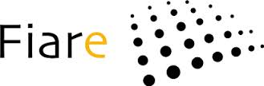

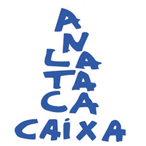
- Assegurances:

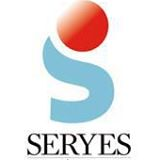

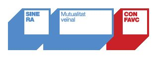
- Energia:

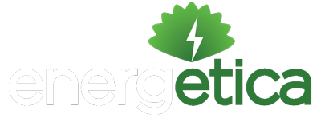

- Comunicacions:

- Habitatge:
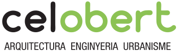
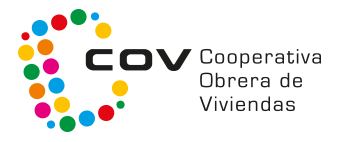

- Serveis online:

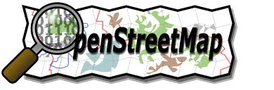
- Programari:

## Que no existeixen?

### **Les creem! Imaginació!**

Fins i tot a mercats cautius han sortit alternatives

&nbsp;

## Mal plantejades?

### **Participem per redreçar-les!**

Compte de no fraccionar la massa crítica!

## Massa inercia?

### **Plantejem noves alternatives**

Colaborant, sense frentismes

Aprofitant lliçons apreses

## El nostre exemple

<svg width='150' height='100'>
<path
	d='M 150 50 L 110 0 v 30 h -110 v 40 h 110 v 30 z'
	style='fill:darkred; stroke: black'
	/>

</svg>

Era massa complexe per l'usuari

Complementem guifi.net
simplificant-ho al usuari.

No dupliquem

## Les grans se les menjen?

---

### **Organització**

---

### **Viralitat**

Aprofitar l'esforç comunitari, implica ser-ne part

## Resistència al canvi?

### El gran enemic: El refranyer

> Más vale malo conocido que bueno por conocer

I així ens va...

## Incertesa? Por?

Costa ben poc crear dubtes
sobre una iniciativa nova:

> Uy esos...

I la resistència al canvi fa la resta

FUD: Fear, uncertainty and doubt

## Incertesa? Por?

### Les nostres armes

Difusió social, no pas comercial

Informació honesta i sostinguda amb dades objectives

Referències de qui ha fet el salt

Acompanyament del salt, salts col·lectius

## Context legal?

### Ens enfrontem a:

Lobbies

Portes giratòries

Corrupció

Nepotisme

Exèrcits d'advocats

## Context legal?

### Les nostres armes

Hackejar la llei existent

Crear estat d'opinió

Insubmisió, desobediència

Instàncies superiors

# Què estem fent?

## Recollir informació

Recollim lo bo i lo dolent

<http://desconexionibex35.org>

## Salts col·lectius

La primera de SomEnergia a Sant Joan

...i van 4.

## Paradetes i xerrades

Difusió i demostració

## Participar

### Grups locals de la comarca

Grup Local de SomEnergia del Baix Llobregat

Grup Local de Coop57 al Baix Llobregat

Guifi.net Baix Llobregat

## I més

Promoure contactes entre la gent que ha fet el salt i la que no

Promoure alternatives on no n'hi han

Complementar les alternatives existents

## Qué falta per fer?

Cobrir molts sectors

Recopilar més informació

Difusió, difusió, difusió

Applicacions socials

Promoure-ho al vostre àmbit

### Podeu col·laborar!

# Guifibaix

## guifibaix.coop

## Objectius

Habilitar alternativa ètica
a l'actual oligopoli de les telecos

Universalizar la banda ampla d'Internet
baixant els preus actuals

Generar ocupació de qualitat
mitjançant fórmules cooperativas

## La cooperativa

Sense ànim de lucre

Els treballadors decideixen les seves condicions laborals

La xarxa pertany als usuaris

Basada en programari lliure, estàndars oberts i xarxa documentada

Servidors alimentats amb renovables

## 

Principi víric:

> Per passar pels altres nodes,
> has de deixar passar pel teu.

## Els nodes

## La xarxa

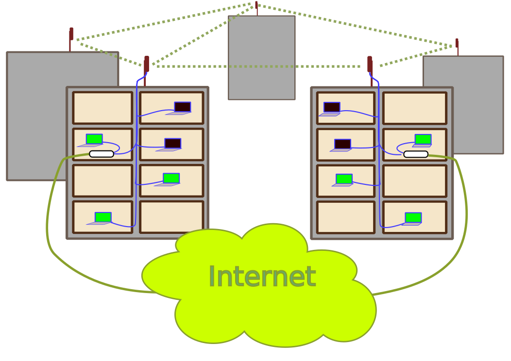

## Cobertura

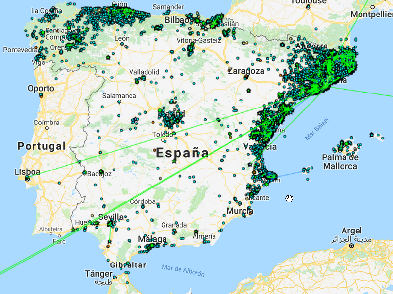

### Més de 34.000 nodes!

## Cal professionalitzar?

Hom pot muntar i mantenir el seu node, pero calen **temps** i **coneixements tècnics**.

A l'escala que volem crèixer, voluntaris no donaríen a l'abast.

Recomanació dels voluntaris existents al poble.

## Rodalies: Sant Feliu

## Rodalies: Torrelles

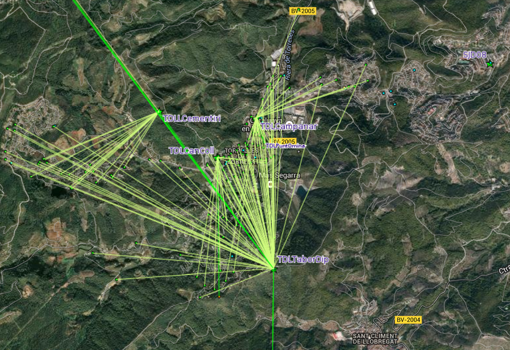

## Compartició d'Internet

## Baix Llobregat

## Telefonia IP

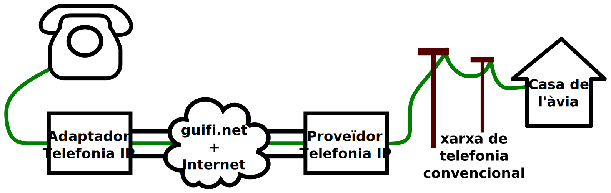

## Serveis afegits

Podem aprofitar l'ample de banda intern posant serveis interns

Molt més potent que una connexio ADSL o fibra stàndard

## Serveis: Mediateca

## Serveis afegits

P2P comunitari, Mediateca

Enmagatzemament i compartició al núvol

Streaming de radio i televisió

Centraleta Telefonia IP

Correu, Hosting

...

## Costos de la xarxa

Sense ànim de lucre però cal cobrir:

- Instal·lació
- Manteniment
- Sortides a Internet
- Telefonia IP
- Costos d'operació
- Equipament comunitari

## Preus: Instal·lació

Cadascú es paga la seva

Hem fet un preu standard de 310€

Pot pujar si cal màstil, obres...

Es paga un sol cop

Es pot repartir en mesos

## Preus: Manteniment

**Normal:**
(12'50€+IVA/mes)
El mode senzill, no em preocupo d'on surt la connexió.

## Preus: Manteniment Aportadors

**Aportador:**
(0€+IVA/mes)
El mode voluntari: aporto la meva connexió a Internet.
Puc designar acompanyants, que m'ajuden a pagar-la.
Màxim 4 acompanyants amb ADSL, 7 amb Fibra.

**Acompanyant:**
(7'50€+IVA/mes)
El mode solidari: ajudo a pagar la connexió a l'aportador.
Rebo un descompte pel manteniment.

<!--

## Preus: Telefonia IP

No som nosaltres: NubipTel/Eticom

Número fixe amb portabilitat: 1,58€/mes + IVA

Trucades a fixes: 1,34¢/min +IVA 

Trucades a mòvils: 4,35¢/min +IVA

-->

## Com procedir

1. Demanar prova de connectivitat
2. Pressupost i convèncer a 3 o 4 veïns
3. Reunió amb els veïns interessats
4. Instal·lació de la xarxa i proves
5. Portabilitat del fixe (i baixa de l'oligopoli!!)

## I els veïns?

És un servei bàsic i no poden vetar la instal·lació.

Però, convé acordar:

- Enganxada de la llum a la comunitat
- Per on baixar els cables
- Pagaments mitjançant la comunitat
- Convidar a que altres veïns s'apuntin

## Doncs endavant!

Apunteu-vos per una **prova de connectivitat** sense compromís

Aneu parlant amb els veïns

&nbsp;

Més informació:

[guifibaix.coop](http://guifibaix.coop)

